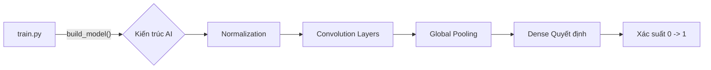

# 🛡️ Báo Cáo Tổng Quan Mô Hình AI Phát Hiện Té Ngã

Chào bạn! Dưới đây là bản tóm tắt trực quan và dễ hiểu nhất về "bộ não" AI trong dự án của bạn.

---

## 🚀 Tóm Tắt Nhanh (Executive Summary)

> [!IMPORTANT]
> Mô hình của bạn là một **TinyCNN** được tối ưu hóa đặc biệt. Nó không chỉ chính xác mà còn cực kỳ nhẹ để chạy trên **ESP32-S3**.

- **Độ nhạy (Recall)**: **98.36%** (Gần như không bỏ sót cú ngã nào).
- **Dung lượng**: **10.7 KB** (Cực nhỏ, tiết kiệm RAM/Flash).
- **Phần cứng**: Chạy trực tiếp trên vi điều khiển, không cần internet.

---

## 🧩 Giải Mã Kiến Trúc (Architecture Breakdown)

Dưới đây là hành trình của dữ liệu từ cảm biến cho đến khi đưa ra cảnh báo:

````carousel
### 1️⃣ Nhận & Chuẩn Hóa
- **Input**: Nhận 100 mẫu dữ liệu (2 giây) từ 6 trục IMU.
- **Normalization**: Đưa mọi thông số về cùng một thang đo để AI không bị "rối".
<!-- slide -->
### 2️⃣ Trích Xuất Đặc Trưng
- **Conv1D (Lớp 1)**: Tìm kiếm các mẫu rung động mạnh (va chạm).
- **MaxPooling**: Giữ lại tín hiệu mạnh nhất, loại bỏ nhiễu linh tinh.
- **Conv1D (Lớp 2)**: Kết hợp các trục (gia tốc + xoay) để hiểu hành vi phức tạp.
<!-- slide -->
### 3️⃣ Nén & Suy Luận
- **GlobalAveragePooling**: Bước "phù thủy" biến dữ liệu chuỗi dài dằng dặc thành một vài con số đặc trưng duy nhất.
- **Dense Layer**: Lớp suy luận logic cuối cùng.
- **Output (Sigmoid)**: Trả về con số xác suất từ 0 đến 1.
````

---

## 📊 Hiệu Năng Thực Tế

> [!TIP]
> Ngưỡng (Threshold) tối ưu được chọn là **0.40**. Điều này giúp mô hình "nhạy" hơn, phát hiện được cả những cú ngã nhẹ nhưng có thể gây nguy hiểm.

| Chỉ số | Kết quả | Ý nghĩa |
| :--- | :--- | :--- |
| **Accuracy** | 90.80% | Độ chính xác tổng thể |
| **Recall** | **98.36%** | Khả năng phát hiện té ngã (Quan trọng nhất) |
| **Precision** | 85.41% | Độ tin cậy của cảnh báo |
| **Dung lượng** | 10.71 KB | Khả năng tích hợp vào chip nhúng |

---

## 💻 Ánh Xạ Mã Nguồn (Code Context)

Để hiểu mã nguồn vận hành thế nào, hãy xem sơ đồ tóm tắt này:



> [!NOTE]
> Toàn bộ logic này nằm trong hàm [build_model](file:///home/zinex/CAPSTONE/AI/edge-aiot-wearable-elderly-safety-monitoring/AI/Edge_AI/result_balanced_v2/code/train.py#71-93) tại file [result_balanced_v2/code/train.py](file:///home/zinex/CAPSTONE/AI/edge-aiot-wearable-elderly-safety-monitoring/AI/Edge_AI/result_balanced_v2/code/train.py).

---

## 💡 Lời Khuyên Cho Thuyết Trình

> [!WARNING]
> Khi trình bày, hãy nhấn mạnh rằng bạn đã sử dụng **Undersampling** để cân bằng dữ liệu. Đây là điểm cộng lớn về mặt kĩ thuật vì nó cho thấy bạn hiểu rõ sự lệch lạc của dữ liệu thực tế (té ngã là hiếm, hoạt động thường ngày là nhiều).

---

**Cần hỗ trợ thêm?** Bạn có thể xem các file chi tiết hơn tại thư mục `docs/analysis/` trong mã nguồn của bạn.
