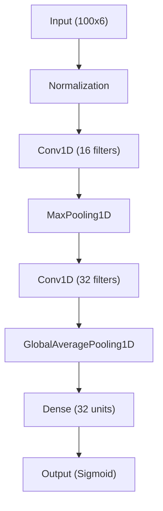

# Hướng Dẫn Trình Bày Phần Mô Hình AI (Báo Cáo/Thuyết Trình)

Để trình bày phần mô hình AI một cách chuyên nghiệp và thuyết phục, bạn nên chia nội dung thành các phần logic sau đây:

## 1. Tổng quan bài toán (Problem Overview)
- **Mục tiêu**: Phát hiện hành vi té ngã của người già thông qua dữ liệu cảm biến thời gian thực.
- **Thách thức**: Cần độ nhạy (Recall) cực cao để không bỏ lỡ cú ngã, đồng thời mô hình phải siêu nhẹ để chạy được trên phần cứng hạn chế (ESP32-S3).

## 2. Dữ liệu và Tiền xử lý (Data & Preprocessing)
Đây là phần rất quan trọng để chứng minh tính khoa học:
- **Nguồn dữ liệu**: Bộ dữ liệu IMU (Gia tốc kế & Cảm biến con quay hồi chuyển).
- **Cửa sổ hóa (Windowing)**: Giải thích việc chia dữ liệu thành các đoạn 2 giây (100 mẫu) để bắt trọn khoảnh khắc té ngã.
- **Cân bằng dữ liệu (Class Balancing)**: Nêu rõ phương pháp **Undersampling** để giải quyết việc lệch dữ liệu (do hành động bình thường nhiều hơn nhiều so với té ngã).

## 3. Kiến trúc mô hình (Architecture)
Sử dụng hình ảnh hoặc sơ đồ để mô tả:

- **Tại sao chọn CNN?**: Giải thích khả năng trích xuất đặc trưng thời gian tự động.
- **Tại sao chọn GlobalAveragePooling?**: Nhấn mạnh việc giảm tham số để tối ưu cho Edge AI.

## 4. Quy trình huấn luyện (Training Loop)
- **Hàm mất mát (Loss)**: Binary Crossentropy.
- **Tối ưu hóa (Optimizer)**: Adam.
- **Chiến lược**: Early Stopping (dừng sớm để tránh quá khớp).

## 5. Kết quả đánh giá (Evaluation)
Hãy trình bày các con số thực tế:
- **Độ phủ (Recall)**: 98.36% (Nhấn mạnh đây là chỉ số quan trọng nhất).
- **Độ chính xác (Accuracy)**: 90.80%.
- **Ma trận nhầm lẫn (Confusion Matrix)**: Cho thấy số ca phát hiện đúng và số ca bị nhầm.
- **Đường cong ROC/PR**: Chứng minh khả năng phân loại ổn định của mô hình.

## 6. Tối ưu hóa cho thiết bị nhúng (Edge AI Optimization)
- **Định dạng**: TensorFlow Lite (TFLite).
- **Lượng tử hóa (Quantization)**: Chuyển đổi sang INT8 để giảm dung lượng (~10.7 KB) và tăng tốc độ xử lý.
- **Triển khai**: Xuất file Header (.h) để tích hợp trực tiếp vào firmware ESP32.

## 7. Kết luận (Conclusion)
- Khẳng định mô hình đáp ứng tốt tiêu chí: **Chính xác - Nhạy - Nhẹ**.
- Hướng phát triển: Thu thập thêm dữ liệu từ các môi trường thực tế khác nhau để tăng độ bền bỉ (robustness).
