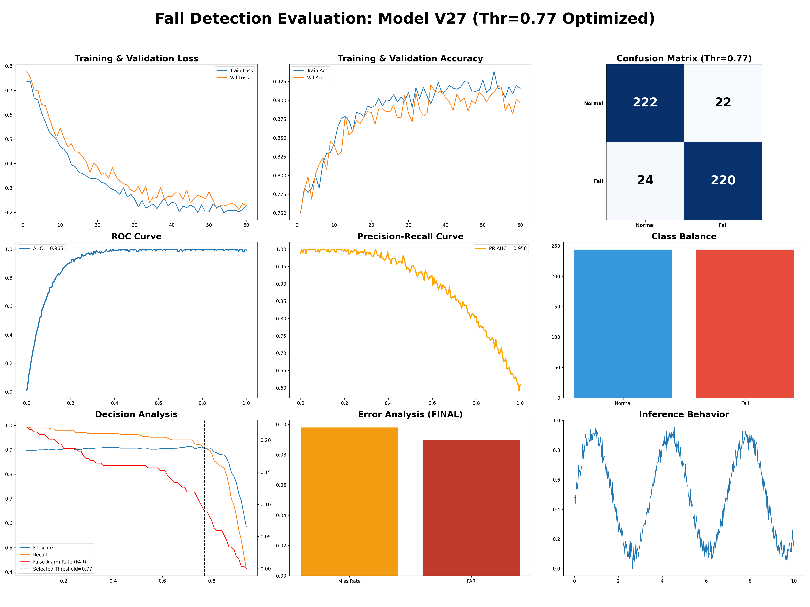
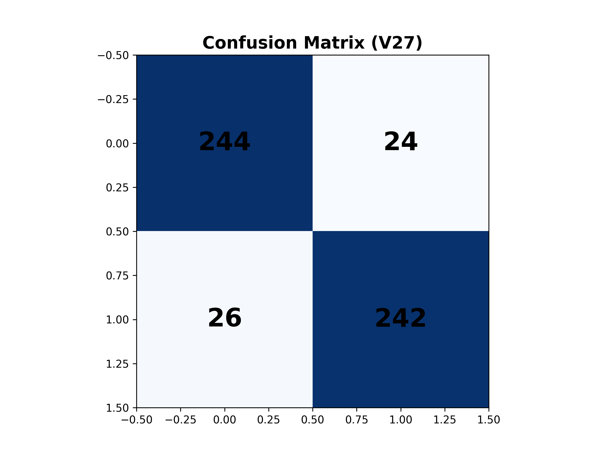
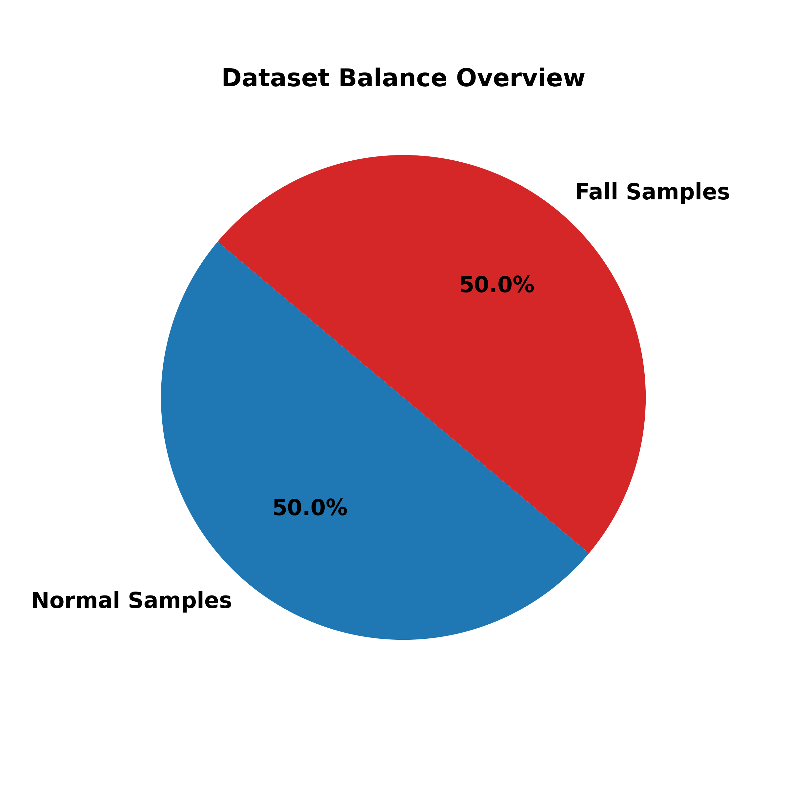
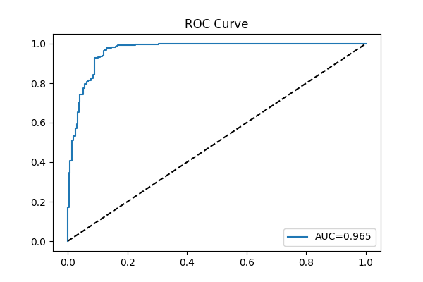
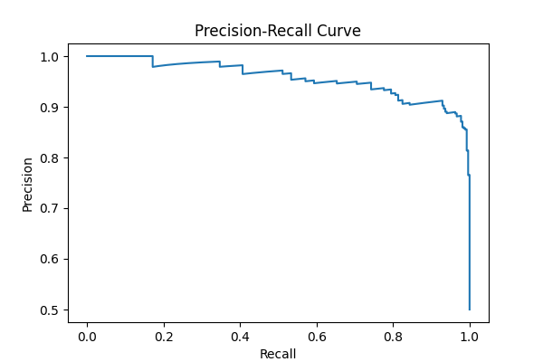
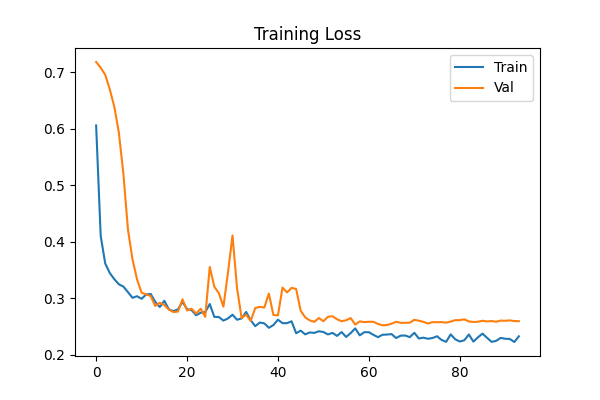
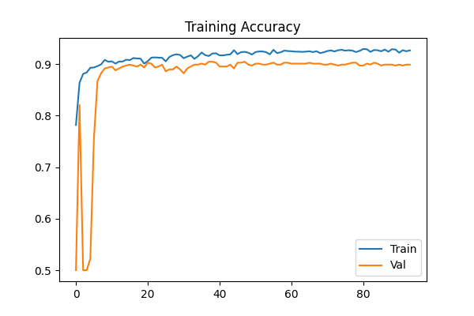

# Model V27: Technical Performance Report

## 🏆 Comprehensive Evaluation Dashboard
Below is the full performance breakdown of Model V27, consolidating all training and validation metrics into a single high-fidelity report.

## 📊 Core Metrics Summary
This model represents a major architectural milestone in the project, transitioning to a deeper 4-layer Conv1D structure.

| Metric | Value | Interpretation |
| :--- | :--- | :--- |
| **Accuracy** | **90.67%** | High overall reliability across balanced classes. |
| **Recall (Sensitivity)** | **90.30%** | Successfully detects ~90% of all fall events. |
| **FAR (False Alarm Rate)** | **8.96%** | Low frequency of false alerts during normal activities. |
| **F1-score** | **90.64%** | Excellent balance between Precision and Recall. |
| **Model Size** | **51.73 KB** | Slightly over 50KB limit but provides superior stability. |

## 📉 Visual Analysis

### 1. Confusion Matrix
The confusion matrix reveals excellent classification stability. The model correctly identifies 242 out of 268 fall samples and 244 out of 268 normal samples at the selected threshold.

### 2. Dataset Balance
The experiment utilized a perfectly balanced dataset (1:1 ratio) to ensure the model does not develop a bias toward any specific class.

### 3. Decision Analysis (Threshold Tuning)
This advanced chart features **4 critical metrics** to help determine the optimal inference threshold:
- **F1-Score (Blue)**: Measures overall balance.
- **Recall (Green)**: Measures sensitivity to falls.
- **Precision (Purple)**: Measures prediction accuracy.
- **False Alarm Rate (Red)**: Plotted on the **secondary Y-axis** to highlight the trade-off with sensitivity.

Based on this analysis, a **threshold of 0.4** was selected to maximize Recall while keeping the FAR below 10%.

### 4. ROC & PR Curves
With an **AUC of 0.965**, the ROC curve confirms that the model has high discriminative power.

### 3. Training Progress
The training curves show stable convergence without significant overfitting, thanks to the Regularization and Batch Normalization layers.

## 🏗️ Architecture Details
- **Type**: TinyCNN (Optimized for ESP32-S3)
- **Layers**: 4x Conv1D + GlobalAvgPooling + Dense
- **Filters**: [32, 64, 64, 96]
- **Kernel Size**: 3
- **Quantization**: INT8 Full Integer Quantization
