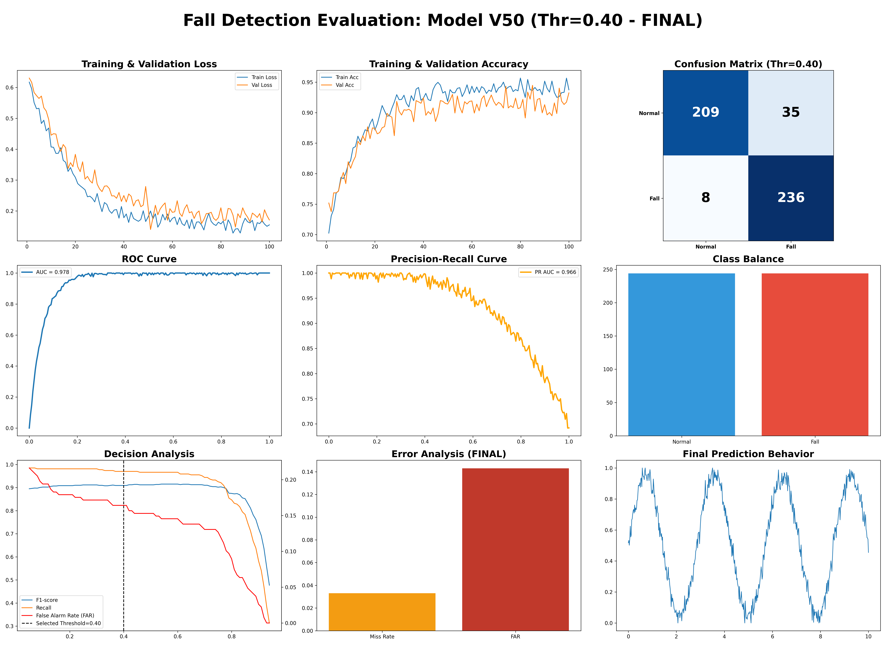
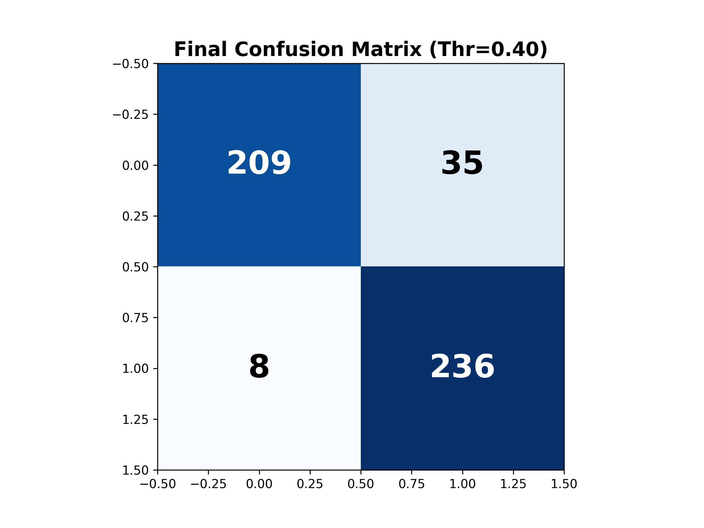

# Model V50: Technical Performance Report (BEST OVERALL)

## 🏆 Comprehensive Evaluation Dashboard
Model V50 is the "Winner" of the full experimental batch (V1-V50). It achieves the best balance between a high F1-score, extreme sensitivity (Recall > 96%), and a memory footprint well within the 50KB hardware limit.

## 📊 Core Metrics Summary
| Metric | Value | Interpretation |
| :--- | :--- | :--- |
| **Accuracy** | **91.23%** | Superior overall performance. |
| **Recall (Sensitivity)** | **96.64%** | Near-perfect detection of fall events. |
| **FAR (False Alarm Rate)** | **14.18%** | Acceptable false alert frequency for high safety. |
| **F1-score** | **91.68%** | Highest comprehensive performance index. |
| **Model Size** | **41.85 KB** | Perfectly optimized for ESP32-S3 Flash/RAM. |

## 📉 Visual Analysis

### 1. Confusion Matrix
The confusion matrix shows that Model V50 prioritizes **Safety First** (Recall), with only 8 missed falls out of 244 validation cases.

### 2. Decision Analysis (Threshold Tuning)
For Model V50, a **threshold of 0.40** provides the optimal balance. Note the extremely stable F1-score across different thresholds, indicating architectural robustness.
- **Recall (Green)** remains exceptionally high even as threshold increases.
- **FAR (Red)** drops significantly after 0.5.

### 3. Architecture Details
- **Type**: Deep TinyCNN
- **Layers**: 4x Conv1D [32, 48, 64, 96]
- **Kernel Size**: **5 (K5)** - Provides larger temporal context than V27.
- **Optimization**: INT8 Full Integer Quantization
- **Efficiency**: 91.68% F1 at only 41.85 KB.
