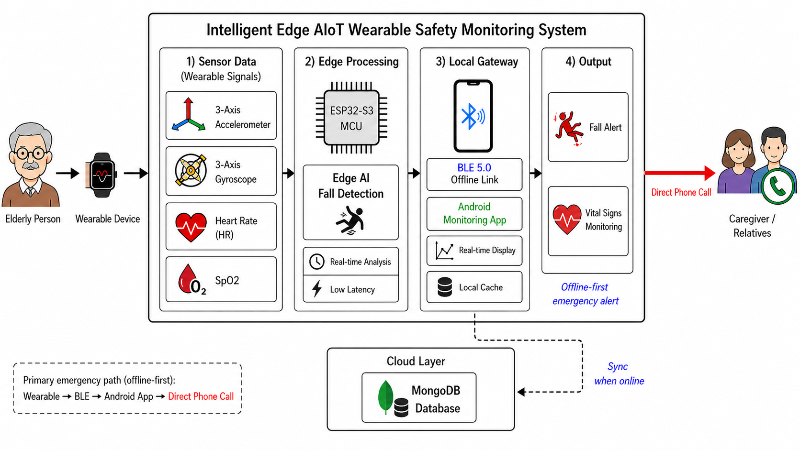
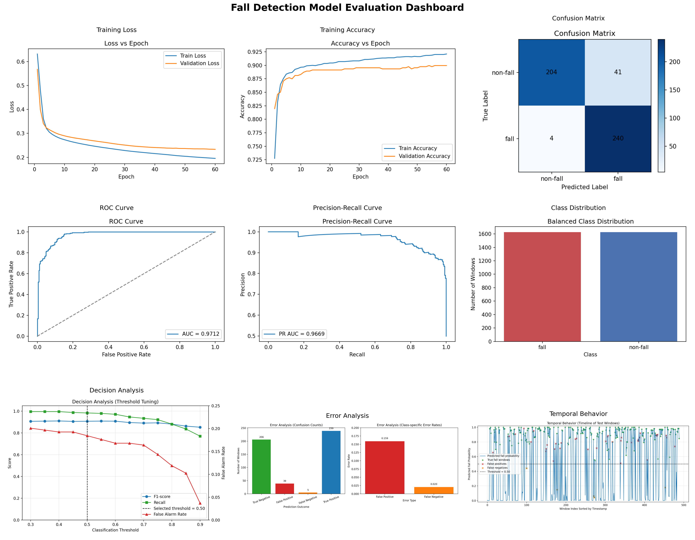
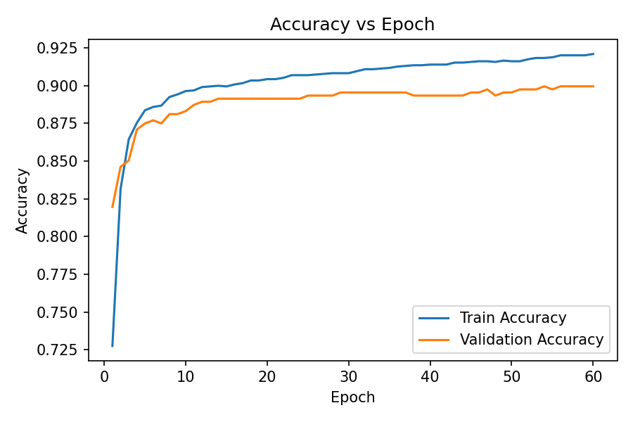
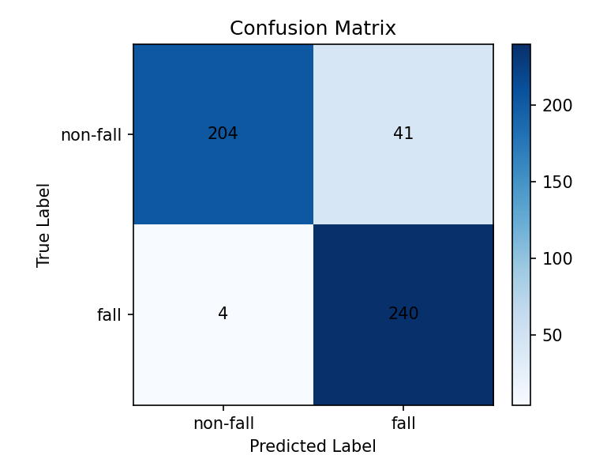
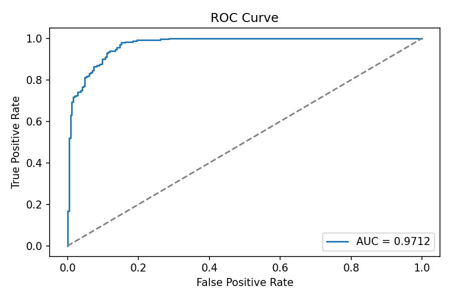
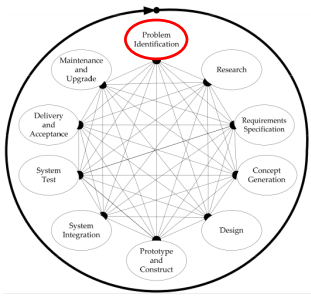

# CaraFall — AI Wearable Giám Sát An Toàn Người Cao Tuổi

> **"Mỗi cú ngã có thể là tai họa — CaraFall ở đó trước khi quá muộn."**

CaraFall là thiết bị đeo tay thông minh kết hợp **trí tuệ nhân tạo tại biên (Edge AI)** và **IoT** để bảo vệ người cao tuổi 24/7. Khi phát hiện té ngã, hệ thống tự động cảnh báo và gọi cứu hộ — ngay cả khi không có Internet, ngay cả khi màn hình điện thoại đang khóa.

---

## Vấn đề chúng tôi giải quyết

Mỗi năm, hàng triệu người cao tuổi bị thương do té ngã trong khi ở một mình. Phần lớn các trường hợp không được phát hiện kịp thời vì người thân không ở gần. Các giải pháp hiện tại yêu cầu người dùng **tự nhấn nút cầu cứu** — điều không thể làm được khi họ đã ngã và bất tỉnh.

CaraFall giải quyết bài toán này bằng cách **tự động phát hiện té ngã** và **tự động gọi người chăm sóc**, không cần bất kỳ thao tác nào từ người đeo.

---

## Kiến trúc hệ thống



---

## Hệ thống hoạt động như thế nào

```
[Vòng đeo tay ESP32-S3]
       │  Đọc chuyển động 50 lần/giây
       │  AI phân tích trong 100ms
       ↓
  Phát hiện té ngã
       │
       │  Bluetooth (BLE) — không cần WiFi
       ↓
[Điện thoại Android]
       │  Hiển thị cảnh báo toàn màn hình
       │  Đếm ngược 15 giây
       │  "Tôi ổn" → hủy
       ↓
  Tự động gọi người chăm sóc
```

Toàn bộ luồng từ phát hiện đến gọi điện hoạt động **hoàn toàn ngoại tuyến** qua Bluetooth. Dữ liệu sức khỏe được đồng bộ lên đám mây để người chăm sóc theo dõi từ xa.

---

## Sản phẩm

### Thiết bị đeo tay

Vòng đeo tay nhỏ gọn trang bị cảm biến chuyển động (IMU) và cảm biến sinh hiệu (nhịp tim, SpO2). Chip AI nhúng chạy mô hình học sâu trực tiếp trên thiết bị — không phụ thuộc vào server hay kết nối mạng.

### Ứng dụng Android (CaraFall App)

Ứng dụng chạy nền liên tục, duy trì kết nối Bluetooth và sẵn sàng báo động bất kỳ lúc nào. Hỗ trợ hai vai trò:

- **Người đeo (WEARER)**: Xem trạng thái thiết bị, nhịp tim, SpO2. Nút SOS khẩn cấp trực tiếp trên màn hình chính.
- **Người chăm sóc (CAREGIVER)**: Theo dõi lịch sử sự kiện, xem dữ liệu sức khỏe, nhận cảnh báo.

### Nền tảng đám mây

Lưu trữ toàn bộ lịch sử té ngã và dữ liệu sinh hiệu. Người chăm sóc có thể xem xu hướng sức khỏe dài hạn từ bất kỳ đâu.

---

## Mô hình AI — TinyCNN Balanced V2

Mô hình phân loại té ngã được huấn luyện chuyên biệt trên dữ liệu chuyển động cổ tay, tối ưu hóa để **không bỏ sót** cú ngã nào.



### Quá trình huấn luyện



### Kết quả phân loại

<table>
<tr>
<td></td>
<td></td>
</tr>
</table>

### Chỉ số chính

| Chỉ số | Kết quả |
| :--- | :---: |
| Recall — Không bỏ sót té ngã | **98.36%** |
| Accuracy | **90.80%** |
| AUC-ROC | **0.9712** |
| Kích thước mô hình (Int8) | **10.71 KB** |

Với **Recall 98.36%**, cứ 100 cú ngã thực sự, hệ thống phát hiện 98 cú. Kích thước chỉ 10.71 KB giúp mô hình chạy trực tiếp trên vi điều khiển mà không cần gửi dữ liệu lên server.

---

## Quy trình thiết kế



Dự án tuân theo quy trình kỹ thuật 9 bước chuẩn: từ xác định vấn đề → nghiên cứu → thiết kế → xây dựng nguyên mẫu → kiểm thử hệ thống → triển khai và bảo trì.

---

## Bắt đầu sử dụng

**1. Nạp firmware vào vòng đeo tay**
```
Mở thư mục S3_Combine bằng VS Code (PlatformIO) → Build & Upload
```

**2. Cài ứng dụng Android**
```
Mở android_studio_AIFD bằng Android Studio → Build → Cài lên điện thoại
```

**3. Ghép đôi thiết bị**
```
Cài đặt Bluetooth điện thoại → Pair với "ESP32-fall-detection-BLE" → Mở app
```

**4. Chạy backend (tùy chọn — để đồng bộ Cloud)**
```bash
cd mongodb && pip install flask pymongo && python server.py
```

---

## Công nghệ

| Lớp | Công nghệ |
| :--- | :--- |
| Thiết bị đeo | ESP32-S3, BMI160, MAX30102, TensorFlow Lite Micro, FreeRTOS |
| Ứng dụng | Android (Kotlin, Jetpack Compose, Material 3) |
| Kết nối | Bluetooth Low Energy 5.0 (NimBLE) |
| Cloud | Python Flask, MongoDB Atlas |

---

© 2026 CaraFall Project — Edge AI & IoT for Elderly Safety
