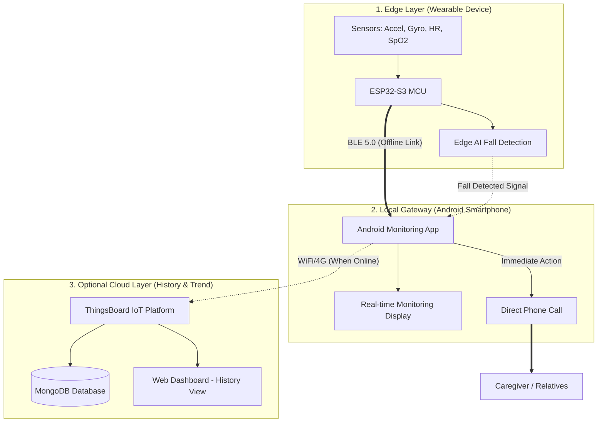

# 🏢 Kiến Trúc Hệ Thống Offline-First (System Architecture) - v3.0

Kiến trúc này được tối ưu hóa cho tính thực tế và an toàn cao nhất, đảm bảo cảnh báo té ngã hoạt động ngay cả khi không có kết nối Internet.

## 🚀 Sơ Đồ Khối Thực Tế (Practical System Diagram)

---

## 🛠️ Luồng Xử Lý Đặc Thù (Core Logic Flow)

### 1. Luồng Cảnh Báo Khẩn Cấp (Ưu tiên số 1 - Offline)
*   **Kết nối**: Thiết bị đeo kết nối trực tiếp với Điện thoại qua **BLE**. Luồng này hoàn toàn không phụ thuộc vào Wi-Fi hay 4G/5G.
*   **Hành động**: Ngay khi AI trên ESP32 phát hiện té ngã, nó gửi tín hiệu qua BLE. Ứng dụng Android lập tức thực hiện **CUỘC GỌI TRỰC TIẾP** đến số điện thoại người thân đã cài đặt sẵn.
*   **Ưu điểm**: Đảm bảo tính mạng người già ngay cả trong môi trường không có mạng.

### 2. Luồng Đồng Bộ Dữ Liệu (Đồng bộ sau - Async)
*   **Cơ chế**: Dữ liệu sinh tồn và lịch sử té ngã được lưu tạm (Cache) trên Ứng dụng Android.
*   **Đồng bộ**: Khi điện thoại có kết nối Internet (Wi-Fi/4G), ứng dụng sẽ tự động đẩy dữ liệu lên **ThingsBoard** và lưu vào **MongoDB**.
*   **Mục đích**: Lưu trữ dữ liệu lịch sử bền vững và phân tích xu hướng sức khỏe lâu dài.

### 3. Tầng Ứng Dụng & Xem Lịch Sử
*   **App Android**: Đóng vai trò vừa là bộ hiển thị thời gian thực, vừa là trung tâm xử lý cảnh báo khẩn cấp.
*   **Web Dashboard**: Chỉ sử dụng để người thân hoặc bác sĩ xem lại tình trạng sức khỏe **trong quá khứ**, đánh giá tiến triển sức khỏe theo thời gian.

---

## 📊 Bảng Thông Số Kỹ Thuật Điều Chỉnh

| Feature | Support | Target / Accuracy | Requirement |
| :--- | :--- | :--- | :--- |
| **Fall Detection** | Edge AI | **Accuracy ≥ 95%** | Latency < 2s |
| **Heart Rate (HR)** | MAX30102 | **Error ±2 BPM** | Refresh ≥ 0.2 Hz |
| **SpO2 Monitoring**| MAX30102 | **Error ±3%** | Refresh ≥ 0.2 Hz |
| **Alert System** | Android | Direct Phone Call | Immediate (< 3s) |
| **Battery Life** | MCU/Power | **> 6 days** | 24/7 Monitoring |
| **BOM Cost** | Hardware | **< 2.500.000đ** | Market Competitive |
| **Weight** | Mechanical | **≤ 70g** | Wearable Comfort |
| **Scalability** | Cloud | > 100 Users | Cloud/DB Support |

---

> [!IMPORTANT]
> **Triết lý thiết kế:** "Cảnh báo là tức thời (Offline), Dữ liệu là lâu dài (Online)". Đây là cách tiếp cận thông minh nhất cho các thiết bị an toàn y tế, vì nó loại bỏ rủi ro mất kết nối mạng - yếu tố tử huyệt của các hệ thống IoT thuần túy.
