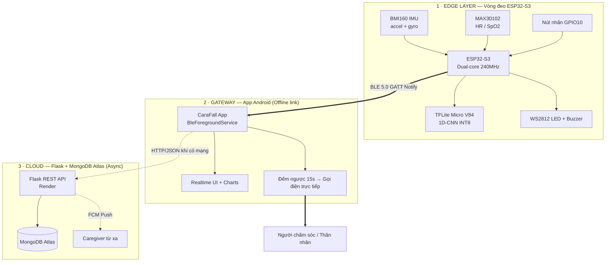

# MASTER SPECIFICATION — CaraFall / AIFD
### Intelligent Edge-AIoT Wearable for Real-Time Elderly Safety Monitoring

> **Tài liệu đặc tả tổng hợp (Single Source of Truth)** — gộp đặc tả cấp hệ thống, đặc tả từng module và đặc tả từng kỹ thuật.
> Mọi số liệu trong tài liệu này được **đối chiếu trực tiếp với mã nguồn thực tế** trong repo (có ghi đường dẫn tham chiếu).

| | |
|---|---|
| **Mã dự án** | CaraFall (tên thương mại) / AIFD (AI Fall Detection — tên kỹ thuật) |
| **Phiên bản tài liệu** | v1.0 — MASTER |
| **Ngày phát hành** | 2026-06-08 |
| **Người biên soạn** | PM / System Architect (rà soát toàn dự án) |
| **Trạng thái** | Baseline — phản ánh hiện trạng repo tại commit `dien-zinex` |
| **Phạm vi** | Firmware ESP32-S3, Mô hình AI (TFLite Micro), App Android, Nền tảng Cloud |
| **Tài liệu thay thế** | Hợp nhất & cập nhật các bản `*/SPECIFICATIONS.md` rời rạc (đã lỗi thời — xem §10) |

---

## Mục lục

1. [Tóm tắt điều hành (Executive Summary)](#1-tóm-tắt-điều-hành)
2. [Đặc tả cấp hệ thống (System Specification)](#2-đặc-tả-cấp-hệ-thống)
3. [Module M1 — Edge Hardware (Thiết bị đeo)](#3-module-m1--edge-hardware)
4. [Module M2 — Firmware & RTOS](#4-module-m2--firmware--rtos)
5. [Module M3 — AI Model (TinyML)](#5-module-m3--ai-model-tinyml)
6. [Module M4 — BLE Communication](#6-module-m4--ble-communication)
7. [Module M5 — Android Application](#7-module-m5--android-application)
8. [Module M6 — Cloud & Database](#8-module-m6--cloud--database)
9. [Đặc tả kỹ thuật cốt lõi (Technique Specifications)](#9-đặc-tả-kỹ-thuật-cốt-lõi)
10. [Ma trận truy vết yêu cầu & Sai lệch spec (Traceability & Spec Drift)](#10-ma-trận-truy-vết-yêu-cầu--sai-lệch-spec)
11. [Tổng kết kiểm thử (Test Summary)](#11-tổng-kết-kiểm-thử)
12. [Rủi ro kỹ thuật & Khuyến nghị (Risks)](#12-rủi-ro-kỹ-thuật--khuyến-nghị)
13. [Phụ lục: Bản đồ mã nguồn & Thuật ngữ](#13-phụ-lục)

---

## 1. Tóm tắt điều hành

**CaraFall** là hệ thống Edge-AIoT 3 tầng phát hiện té ngã cho người cao tuổi, với triết lý thiết kế cốt lõi:

> **"Cảnh báo là tức thời (Offline-first), Dữ liệu là lâu dài (Cloud-sync)."**

Toàn bộ đường dây cứu hộ khẩn cấp (phát hiện ngã → cảnh báo → gọi điện) hoạt động **hoàn toàn không cần Internet**, chỉ qua BLE giữa vòng đeo và điện thoại. Cloud chỉ đóng vai trò lưu trữ lịch sử & giám sát từ xa.

### Ba tầng kiến trúc

| Tầng | Thành phần | Vai trò chính |
|---|---|---|
| **Edge** | Vòng đeo ESP32-S3 + BMI160 + MAX30102 | Lấy mẫu IMU 50 Hz, chạy AI phát hiện ngã tại chỗ, gửi cảnh báo BLE |
| **Gateway** | App Android (Kotlin/Compose) | Nhận BLE, hiển thị realtime, đếm ngược 15s, **gọi điện trực tiếp** cho người chăm sóc |
| **Cloud** | Flask + MongoDB Atlas (deploy Render) | Lưu vitals/sự kiện, đăng nhập đa vai trò, push FCM cho caregiver |

### Chỉ số đạt được nổi bật (tại thời điểm rà soát)

| Hạng mục | Giá trị | Nguồn |
|---|---|---|
| Mô hình AI production | **V84** — F1 = 93.45%, Recall = 98.51%, FAR = 12.31% | `AI/model_updated_version_84/results/metrics_summary.txt` |
| Kích thước model (INT8) | **62.09 KB** (63,576 bytes) | `AI/model_updated_version_84/models/fall_detection_v84.tflite` |
| Số phiên bản model đã thử nghiệm | **90 (V1→V90)** | `AI/model_comparison_v1_v90.md` |
| Test plan | **78 scenarios** — 69 executed, 68 PASS, 1 FAIL | `System_Architecture/test_plan/TEST_PLAN_OVERVIEW.md` |
| Tuổi thọ pin (mô phỏng, 1000 mAh) | ~17 h (firmware hiện tại) → ~44.5 h (có light-sleep) | `S3_AIFD_V2(Pin)/tools/power_sim.py` |

> ⚠️ **Lưu ý điều hành:** có một số **sai lệch giữa mục tiêu M1 ban đầu và hiện trạng** (tuổi thọ pin, HR/SpO2 đang giả lập, cấu hình dải đo accelerometer). Các điểm này được liệt kê minh bạch tại **§10** và **§12** — đây là trách nhiệm rà soát của PM, không phải để che giấu.

---

## 2. Đặc tả cấp hệ thống

### 2.1 Mục tiêu & cam kết cốt lõi (5 trụ cột)

1. **Phát hiện ngã chính xác** — đa dạng kiểu ngã, đa dạng tư thế.
2. **Không báo nhầm** các hoạt động sinh hoạt hằng ngày (ADL).
3. **Gọi cứu hộ kịp thời** trong mọi trạng thái điện thoại (khóa màn hình, Doze, DND…).
4. **Giám sát liên tục** 24/7 không gián đoạn.
5. **Hoạt động ổn định** trong điều kiện môi trường thực tế.

### 2.2 Sơ đồ khối hệ thống



### 2.3 Luồng nghiệp vụ chính

**(A) Đường khẩn cấp — Offline, ưu tiên #1:**
```
Ngã → BMI160 50Hz → cascade gates → TFLite V84 → FSM (FALL_WATCH→STILL_TIMING)
   → BLE ALERT → App full-screen alert → đếm ngược 15s
   → [không hủy] → Gọi điện Caregiver   |   [bấm "Tôi ổn" / nút cứng] → SAFE → hủy
```

**(B) Đường đồng bộ dữ liệu — Async, ưu tiên #2:**
```
Vitals/sự kiện → cache local (SQLite/SharedPrefs) → khi có Internet → POST Flask → MongoDB
   → Caregiver xem lịch sử / nhận FCM
```

### 2.4 Bảng chỉ tiêu hệ thống (System-level KPIs)

| # | Chỉ tiêu | Mục tiêu (M1) | Hiện trạng | Trạng thái |
|---|---|---|---|---|
| SYS-01 | Độ chính xác phát hiện ngã | Accuracy ≥ 95% | Acc 93.10%, Recall 98.51%, F1 93.45% | 🟡 Recall vượt; Accuracy dưới mục tiêu 95% |
| SYS-02 | Độ trễ phát hiện (edge) | < 2 s | 1 cửa sổ = 2.0 s + inference (~tens ms) | 🟢 Đạt (≈2 s/cửa sổ) |
| SYS-03 | Độ trễ End-to-End (ngã→chuông) | < 30 s | 15 s đếm ngược + ~vài giây | 🟢 Đạt (AT_EMG_04 PASS) |
| SYS-04 | Sai số nhịp tim | ±2 BPM | **Đang giả lập** (chưa có driver PPG) | 🔴 Chưa nghiệm thu thực |
| SYS-05 | Sai số SpO2 | ±3% | **Đang giả lập** | 🔴 Chưa nghiệm thu thực |
| SYS-06 | Gọi điện khẩn cấp | < 3 s sau countdown | TelecomManager + fallback ACTION_DIAL | 🟢 Đạt (IT_EMERGENCY 7/7 PASS) |
| SYS-07 | Tuổi thọ pin | > 6 ngày | ~17 h (firmware hiện tại) | 🔴 Khoảng cách lớn — xem §12 |
| SYS-08 | Khả năng mở rộng | > 100 users | MongoDB Atlas + auth đa vai trò | 🟢 Kiến trúc hỗ trợ |
| SYS-09 | Cân nặng | ≤ 70 g | Phụ thuộc cơ khí | ⬜ Chưa đo |
| SYS-10 | Chi phí BOM | < 2.500.000đ | Phụ thuộc linh kiện | ⬜ Chưa chốt |

> Chú thích: 🟢 đạt · 🟡 đạt một phần · 🔴 chưa đạt/khoảng cách lớn · ⬜ chưa đo.

---

## 3. Module M1 — Edge Hardware

**Tham chiếu:** `S3_AIFD_V2(Pin)/src/main.cpp` (PIN CONFIG, BMI160 REGISTERS), `S3_AIFD_V2(Pin)/platformio.ini`

### 3.1 Bo mạch chính (MCU)

| Đặc tính | Thông số | Ghi chú |
|---|---|---|
| MCU | ESP32-S3 (Super Mini) | Board target `esp32-s3-devkitm-1` |
| CPU | Xtensa LX7 **dual-core @ 240 MHz** | Hỗ trợ vector/AI ops |
| Flash | 4 MB (`flash_size = 4MB`) | Partition `default.csv` |
| Framework | Arduino + ESP-IDF (PlatformIO) | |
| RAM sử dụng (firmware V2) | **31.6%** (103,704 / 327,680 B) | Đo lúc build thành công |
| Flash sử dụng (firmware V2) | **64.2%** (841,873 / 1,310,720 B) | Đo lúc build thành công |

### 3.2 Cảm biến & ngoại vi

| Linh kiện | Giao tiếp | Cấu hình thực tế (theo code) | Mục đích |
|---|---|---|---|
| **BMI160** (IMU 6 trục) | I2C (addr `0x68`/`0x69`) | ODR 100 Hz, **Accel ±2g** (`REG_ACC_RANGE=0x03`, 16384 LSB/g), **Gyro ±2000 dps** (`REG_GYR_RANGE=0x00`, 16.4 LSB/dps) | Phát hiện va chạm & thay đổi tư thế |
| **MAX30102** (PPG) | I2C (addr `0x57`) | `particleSensor.setup()` mặc định | Nhịp tim & SpO2 (**hiện giả lập** — xem §10) |
| **WS2812 (NeoPixel)** | GPIO 5 (data), GPIO 4 (VCC) | brightness 50/255 (~20%) | LED trạng thái |
| **Buzzer** | GPIO 7 | tone **2300 Hz** | Báo động âm thanh |
| **Nút nhấn** | GPIO 10 | `INPUT_PULLUP`, ngắt FALLING | SAFE / SOS thủ công |
| **I2C bus** | SDA=GPIO 8, SCL=GPIO 9 | 100 kHz, timeout 20 ms | Chung cho BMI160 + MAX30102 |

> ⚠️ **Phát hiện kỹ thuật (cần xác minh):** Accelerometer đang cấu hình **±2g** (`REG_ACC_RANGE=0x03` + `ACC_LSB_PER_G=16384`). Với 3 trục, biên độ vector tối đa chỉ ~3.46 g, **không bao giờ đạt** ngưỡng `CANDIDATE_ACC_THRESHOLD = 7.5 g`. Hệ quả: cổng candidate trên thực tế **chỉ kích hoạt bằng gyro (>240 dps)**; nhánh acc cao bị vô hiệu. Nếu thiết kế kỳ vọng bắt impact mạnh bằng accel, cần đổi sang **±16g** (`0x0C`, `ACC_LSB_PER_G=2048`). Xem §12-R3.

### 3.3 Sơ đồ chân (Pin map)

| GPIO | Chức năng | GPIO | Chức năng |
|---|---|---|---|
| 4 | LED VCC (nguồn module RGB) | 8 | I2C SDA |
| 5 | WS2812 Data In | 9 | I2C SCL |
| 7 | Buzzer | 10 | Nút nhấn (pull-up) |

---

## 4. Module M2 — Firmware & RTOS

**Tham chiếu:** `S3_AIFD_V1/src/main.cpp` (bản gốc), `S3_AIFD_V2(Pin)/src/main.cpp` (bản tối ưu adaptive)

### 4.1 Hai thế hệ firmware

| | **V1 (always-on)** | **V2(Pin) — Adaptive RTOS** |
|---|---|---|
| Lấy mẫu IMU | 50 Hz liên tục | 10 Hz idle → 50 Hz khi có chuyển động |
| `loop()` | polling 10 ms (button, blink, vitals…) | gần như rỗng (`vTaskDelay`) |
| LED khi idle | xanh sáng liên tục | **tắt** (tiết kiệm điện) |
| BLE | stream BMI 5s + vitals liên tục | event-driven, vitals chỉ khi đã kết nối |
| Pipeline AI | giữ nguyên (preserved) | **giữ nguyên byte-for-byte** |
| Tuổi thọ pin (mô phỏng) | ~16.3 h | ~17.1 h (chưa light-sleep) |

> Bản V2 là kết quả refactor "power-optimized, event-driven" nhưng **không thay đổi logic an toàn**. Build PlatformIO **thành công** (xác minh ngày rà soát).

### 4.2 Cấu trúc tác vụ FreeRTOS (V2)

| Task | Core | Prio | Kích hoạt | Vai trò |
|---|---|---|---|---|
| `MotionMonitor` | 0 | 2 | 10 Hz poll khi IDLE | Phát hiện chuyển động → đánh thức HighRate |
| `HighRateImu` | 0 | MAX-1 | block tới khi có chuyển động | Lấy mẫu 50 Hz, gom cửa sổ 100 mẫu → notify AI |
| `AI_INFER` | 1 | 1 | block tới khi đủ cửa sổ | Cascade gates + TFLite + FSM |
| `BLE_TX` | 1 | 2 | block trên `bleQueue` | Điểm **duy nhất** gọi `notify()` |
| `BUTTON` | 1 | 3 | ngắt GPIO → notify | Debounce + SAFE/SOS |
| `LED` | 0 | 1 | notify + interval blink | Render LED, chỉ thức khi cần |

### 4.3 Máy trạng thái System Mode (V2)

```
MODE_IDLE_MONITOR ──(motion)──▶ MODE_MOTION_CAPTURE ──▶ MODE_AI_INFERENCE
        ▲                                                      │
        │                                              (fall_prob ≥ 0.42 & still)
        │ (quiet windows)                                      ▼
        └──────── MODE_COOLDOWN ◀── MODE_ALERT ◀── MODE_FALL_WATCH
```

### 4.4 Hằng số cấu hình lấy mẫu & cửa sổ (an toàn — KHÔNG đổi giữa V1/V2)

| Hằng số | Giá trị | Ý nghĩa |
|---|---|---|
| `SAMPLE_PERIOD_MS` | 20 | 50 Hz |
| `kWindowSize` | 100 | 100 mẫu = 2.0 s |
| `kInferenceStride` | **100** | **Cửa sổ KHÔNG chồng lấn** (xem §9.1 & §10) |
| `kFeatureCount` | 6 | ax,ay,az,gx,gy,gz |
| `kTensorArenaSize` | 60 KB | Vùng nhớ TFLite Micro |

### 4.5 Bảng ngưỡng pipeline phát hiện ngã (toàn bộ — nguồn an toàn)

| Hằng số | Giá trị | Vai trò |
|---|---|---|
| `FALL_DECISION_THRESHOLD` | **0.42** | Ngưỡng quyết định của model V84 |
| `CANDIDATE_ACC_THRESHOLD` | 7.5 g | Cổng ứng viên (acc) — *xem cảnh báo §3.2* |
| `CANDIDATE_GYRO_THRESHOLD` | 240 dps | Cổng ứng viên (gyro) |
| `ACTIVITY_ACC_THRESHOLD` | 2.0 g | Cổng hoạt động (acc) |
| `ACTIVITY_GYRO_THRESHOLD` | 50 dps | Cổng hoạt động (gyro) |
| `ACTIVITY_WINDOW_COUNT` | 3 | Cần 3 cửa sổ active liên tiếp |
| `HIGH_IMPACT_ACC_MIN` | 2.0 g | Cổng va chạm mạnh (acc) |
| `HIGH_IMPACT_GYRO_MIN` | 300 dps | Cổng va chạm mạnh (gyro) |
| `FALL_IMPACT_GYRO_MIN` | 20 dps | Yêu cầu xoay tối thiểu |
| `CANCEL_ACC_THRESHOLD` | 3.5 g | Ngưỡng hủy FALL_WATCH/STILL |
| `CANCEL_GYRO_THRESHOLD` | 150 dps | Ngưỡng hủy (cao để tránh hủy nhầm) |
| `STILLNESS_SAMPLES` | 25 | Số mẫu cuối để xét nằm im |
| `STILLNESS_ACC_MIN/MAX` | 0.6 / 1.7 g | Dải acc khi nằm im |
| `STILLNESS_GYRO_MAX` | 100 dps | Trần gyro khi nằm im |
| `FALL_WATCH_WINDOWS` | 5 | Số cửa sổ theo dõi |
| `FALL_STILL_DURATION_MS` | 5000 | Phải nằm im liên tục 5 s |
| `FALL_MONITOR_TIMEOUT_MS` | 10000 | Trần thời gian theo dõi 10 s |
| `AI_WINDOW_DURATION_MS` | 6000 | AI hoạt động tối đa 6 s sau peak |

### 4.6 Hằng số adaptive power (chỉ V2)

| Hằng số | Giá trị | Ý nghĩa |
|---|---|---|
| `MOTION_MONITOR_PERIOD_MS` | 100 | Poll idle 10 Hz |
| `MOTION_WAKE_ACC_DEV_G` | 0.20 | Ngưỡng đánh thức (lệch 1g) |
| `MOTION_WAKE_GYRO_DPS` | 30 | Ngưỡng đánh thức (gyro) |
| `MAX_QUIET_WINDOWS` | 1 | Số cửa sổ "im" trước khi về idle |
| `VITALS_PERIOD_MS` | 25000 | Chu kỳ batch HR/SpO2 |

---

## 5. Module M3 — AI Model (TinyML)

**Tham chiếu:** `AI/model_updated_version_84/`, `AI/model_comparison_v1_v90.md`, `AI/model_selection_V84.md`, `S3_AIFD_V2(Pin)/src/fall_detection_v84.h`

### 5.1 Model production: **V84**

| Thuộc tính | Giá trị |
|---|---|
| Kiến trúc | 1D-CNN — **[32, 64, 64, 96] / Kernel 3 / Dense 32**, batch=32 |
| Tham số | ~56,000 |
| Định dạng triển khai | TFLite Micro **INT8 (post-training quantization)** |
| Kích thước | **62.09 KB** (63,576 bytes — đúng `fall_detection_model_tflite_len`) |
| Input | `(100, 6)` — 100 timestep × 6 kênh IMU |
| Output | `(1)` — xác suất ngã (Sigmoid) |
| Ngưỡng quyết định | **0.42** |
| Epoch dừng | 78 (Early Stopping) |
| Kỹ thuật chống overfit | **Gaussian noise augmentation σ=0.05** + Dropout 0.4 + L2 3e-4 |

### 5.2 Kết quả đánh giá V84 (tập test)

| Metric | Giá trị | Nguồn |
|---|---|---|
| Accuracy | 93.10% | `results/metrics_summary.txt` |
| **Recall (độ nhạy)** | **98.51%** | (chỉ bỏ sót 1.49% ca ngã) |
| Precision | 88.89% | |
| **F1-score** | **93.45%** | Cao nhất trong 90 phiên bản |
| **FAR (báo nhầm)** | **12.31%** | |
| Miss Rate | 1.49% | |

### 5.3 Vì sao chọn V84 (định lượng)

Tài liệu `AI/model_selection_V84.md` chấm điểm tổng hợp ưu tiên an toàn:
`Score = Recall×0.45 + (100−FAR)×0.30 + F1×0.25`. V84 đạt **điểm cao nhất (92.00/100)** trên toàn bộ 90 phiên bản đã pass ràng buộc cứng (Recall ≥ 95%, Size ≤ 80 KB, FAR ≤ 18%).

| Hạng | Version | Recall | F1 | FAR | Score |
|---|---|---|---|---|---|
| 🥇 | **V84** | 98.51% | 93.45% | 12.31% | 92.00 |
| 🥈 | V80 | 97.39% | 93.38% | 11.19% | 91.79 |
| 🥉 | V64 | 96.64% | 93.17% | 10.82% | 91.24 |

### 5.4 Dataset huấn luyện

| Thuộc tính | Giá trị |
|---|---|
| Nguồn | HR_IMU dataset (chuỗi Fall + ADL, kiểu SisFall: mã `F01–F08` = fall, `D01–D11` = ADL) |
| Bài toán production | **Nhị phân** (Fall / Non-fall) |
| Cân bằng | Undersampling 1:1 — **1,628 fall / 1,628 non-fall** (3,256 cửa sổ) |
| Tần số | 50 Hz |
| Cửa sổ | 2.0 s (100 mẫu), 6 kênh |
| Khám phá multiclass (R&D) | Bộ 5-label & 6-label (`fall/sit/walk/hand/crouching[/near_fall]`) tại `data_processing/data/` |

### 5.5 Pipeline tiền xử lý

- Chuẩn hóa **Z-score** nhúng ngay trong model (lớp `Normalization`, 13 params) → không cần tính mean/std runtime trên firmware.
- Lượng tử hóa input INT8: `quantizeInput()` dùng `scale`/`zero_point` của input tensor (xem `S3_AIFD_V2(Pin)/src/main.cpp`).

---

## 6. Module M4 — BLE Communication

**Tham chiếu:** `S3_AIFD_V2(Pin)/BLE_PROTOCOL.md`, `BLE_document.md`, `android_studio_AIFD/.../ble/BlePacketParser.kt`

### 6.1 Cấu trúc GATT

| Thành phần | UUID | Thuộc tính | Hướng |
|---|---|---|---|
| Service | `4fafc201-1fb5-459e-8fcc-c5c9c331914b` | — | — |
| **ALERT** | `beb5483e-36e1-4688-b7f5-ea07361b26a8` | Read + Notify | ESP32→App (ALERT, SAFE) |
| **VITALS** | `7b809f11-63f0-4dca-8e4d-2b4e8384e7c1` | Read + Notify | ESP32→App (BATCH, BMI) |
| **CONTROL** | `f9b2c417-1d15-4ad4-9b52-b94aa0f76b03` | Read + Write | App→ESP32 (READY/PING/LIVE) |

### 6.2 Định dạng gói tin (CSV over BLE, UTF-8)

| Gói | Định dạng | Chu kỳ | Nguồn |
|---|---|---|---|
| `ALERT` | `ALERT,<seq>,<ts_sec>,fall,1,<fall_prob>,<non_fall_prob>` | khi phát hiện | **Real** (V84) |
| `SAFE` | `SAFE,<seq>,<ts_sec>` | khi bấm nút lúc báo động | **Real** (nút cứng) |
| `BATCH` | `BATCH,<seq>,<hr0\|..\|hr4>,<spo2_0\|..\|spo2_4>,<ts0\|..\|ts4>` | mỗi 25 s | **Simulated** (HR/SpO2) |
| `BMI` | `BMI,<seq>,<ts_sec>,<peak_acc_g>,<peak_gyro_dps>,<active>` | mỗi 5 s (live mode) | **Real** (peak IMU) |

> `255` = sentinel "sensor chưa sẵn sàng"; parser Android map → `-1` để UI không hiển thị số giả.

### 6.3 Handshake & cơ chế queue offline

1. App connect → subscribe ALERT + VITALS (ghi CCCD tuần tự).
2. App ghi `READY` vào CONTROL → ESP32 trả `ACK:READY`, đặt `gBleReady=true`.
3. Khi chưa kết nối, gói tin được giữ trong **RAM queue**; sau `READY` mới flush theo FIFO (ALERT trước, BATCH sau).
4. **V2:** mọi notify đi qua `bleQueue` → chỉ `BLE_TX` task gọi `notify()` (tránh đa luồng đụng độ NimBLE).

### 6.4 Tham số BLE

| Tham số | Giá trị | Nguồn |
|---|---|---|
| MTU (App yêu cầu) | **512** (`requestMtu(512)`) | `BleManager.kt` — datasheet cũ ghi 247 |
| Tên quảng bá (firmware) | **`S3_AIFD_V1`** | `NimBLEDevice::init(...)` |
| App lọc scan | prefix `ESP32` / `S3` + Service UUID | `BleManager.autoConnectBondedEsp32()` |
| Bonding | **Tắt** (`deleteAllBonds()`) | tránh GATT 133 sau reflash |

---

## 7. Module M5 — Android Application

**Tham chiếu:** `android_studio_AIFD/app/`, `BleManager.kt`, `BleForegroundService.kt`, `CloudApi.kt`

### 7.1 Yêu cầu nền tảng

| Đặc tính | Giá trị |
|---|---|
| Ngôn ngữ / UI | **Kotlin + Jetpack Compose** |
| minSdk / target / compile | **26 / 34 / 34** (Android 8.0+ → 14) |
| App ID / version | `com.aifd` / `1.0.0` (versionCode 1) |
| HTTP client | OkHttp |
| Kiến trúc | MVVM (ViewModel + StateFlow/SharedFlow) + Foreground Service |

### 7.2 Quyền (Permissions)

`BLUETOOTH(_ADMIN/_SCAN/_CONNECT)`, `ACCESS_FINE/COARSE_LOCATION`, `CALL_PHONE`, `POST_NOTIFICATIONS`, `VIBRATE`, `FOREGROUND_SERVICE(_CONNECTED_DEVICE)`, `WAKE_LOCK`, `USE_FULL_SCREEN_INTENT`, `RECEIVE_BOOT_COMPLETED`, `INTERNET`.

### 7.3 Thành phần lõi

| Thành phần | Vai trò |
|---|---|
| `BleManager` | Quản lý GATT: auto-connect bonded, scan, MTU 512, subscribe, parse, **reconnect backoff 2/5/10/20/60 s**, **connect watchdog 12 s**, khôi phục GATT 133 (removeBond) |
| `BleForegroundService` | "Người bảo vệ bất tử": giữ BLE chạy nền, WakeLock bật màn hình khi ngã, đếm ngược **15 s**, gọi điện (TelecomManager → fallback ACTION_DIAL), kênh thông báo `IMPORTANCE_HIGH` vượt DND |
| `BlePacketParser` | Parser thuần (ALERT/SAFE/BATCH/BMI), trả `null` khi sai định dạng (unit-testable) |
| ViewModels | `AlertVM`, `MonitoringVM`, `HomeVM`, `DeviceVM` |

### 7.4 Vai trò người dùng & màn hình

- **WEARER**: Home (vitals + nút SOS), trạng thái thiết bị.
- **CAREGIVER**: Monitoring (chart lịch sử), History (sự kiện), nhận FCM.
- Màn hình: Login/Register, RoleSelection, Home, Monitoring, History, EventDetail, DevicePairing, Settings, Profile, **FallAlert (full-screen overlay)**.

---

## 8. Module M6 — Cloud & Database

**Tham chiếu:** `mongodb/server.py`, `android_studio_AIFD/.../data/CloudApi.kt`

### 8.1 Hạ tầng thực tế

| Thành phần | Công nghệ |
|---|---|
| API server | **Python Flask** (gunicorn) |
| Deploy | **Render** — `https://edge-aiot-wearable-elderly-safety-4c1i.onrender.com` |
| Database | **MongoDB Atlas** (NoSQL document) |
| Push notification | **Firebase Cloud Messaging (FCM)** — caregiver nhận cảnh báo từ xa |

> ⚠️ Các spec cũ ghi **ThingsBoard/MQTT** — **không đúng hiện trạng**. Hệ thống dùng REST/JSON tự xây trên Flask. Xem §10.

### 8.2 Collections MongoDB

| Collection | Nội dung |
|---|---|
| `users` | Tài khoản, role (WEARER/CAREGIVER), caregiverPhone, wearerName, FCM token, mật khẩu hash |
| `vitals` | HR/SpO2 theo thời gian |
| `fall_events` | Sự kiện ngã (prob, timestamp, ack) |
| `sensor_readings_new` | Dữ liệu cảm biến thô / latest |

### 8.3 REST API (chính)

| Method | Endpoint | Chức năng |
|---|---|---|
| GET | `/api/health` | Health check |
| POST | `/api/auth/register` · `/login` | Đăng ký / đăng nhập |
| GET/PUT | `/api/auth/profile` | Xem / cập nhật hồ sơ |
| POST | `/api/auth/change-password` · `/fcm-token` | Đổi mật khẩu / cập nhật token FCM |
| POST/GET | `/api/vitals` | Upload / truy vấn vitals (range, limit, bucket) |
| POST/GET | `/api/fall_event(s)` | Ghi / truy vấn sự kiện ngã |
| POST | `/api/fall_event/acknowledge` | Caregiver xác nhận đã xử lý |

---

## 9. Đặc tả kỹ thuật cốt lõi

> Phần này đặc tả từng **kỹ thuật/thuật toán** trọng yếu — cái làm nên giá trị kỹ thuật của dự án.

### 9.1 Sliding Window (cửa sổ trượt) — KHÔNG overlap
- **On-device inference (production):** 100 mẫu (2 giây), `kInferenceStride = 100` → **HOÀN TOÀN KHÔNG có overlap**. Mỗi cửa sổ 2 s liền kề, model V84 suy luận đúng 1 lần / 2 s trên input `(100, 6)`.
- Đây là **thiết kế chính thức** của thiết bị (không phải lỗi/sai lệch).
- *Ghi chú minh bạch về huấn luyện:* riêng khâu **sinh tập dữ liệu train**, code dùng `build_windows(stride=50)` (`AI/train_v81_v90.py`, `AI/run_experiments.py`) để **augmentation** — đây là việc tách rời, độc lập với inference; **thiết bị không dùng overlap**.

### 9.2 Cascade Multi-Gate (lọc trước AI — tiết kiệm điện & giảm FAR)
Trình tự cổng trước khi gọi TFLite `Invoke()`:
```
1. Candidate gate : peak_acc > 7.5g  OR peak_gyro > 240dps
2. Activity gate  : ≥ 3 cửa sổ active liên tiếp (acc>2g OR gyro>50dps)
3. High-impact    : ≥1 cửa sổ có acc>2g AND gyro>300dps
4. Impact gate    : peak_gyro ≥ 20dps
5. AI window      : chỉ chạy AI tối đa 6s sau peak
→ Chỉ khi pass hết, mới Invoke() model V84
```
Lợi ích: TinyCNN **không chạy** trong sinh hoạt thường → giảm điện năng & giảm báo nhầm.

### 9.3 TFLite Micro + INT8 Quantization
- Post-training INT8: trọng số 1 byte → model 62.09 KB, chạy được trên MCU.
- Tensor arena 60 KB; `AllocateTensors()` kiểm tra OOM lúc init.
- Quantize input (`quantizeInput`) / dequantize output (`dequantizeOutput`) theo scale/zero-point.

### 9.4 Fall Confirmation FSM (chống báo nhầm bằng xác nhận thời gian)
```
FDS_IDLE ──(fall_prob≥0.42 & nằm im)──▶ FDS_FALL_WATCH (5 cửa sổ)
   ▲                                          │
   │(cử động mạnh > cancel)            (hết FALL_WATCH)
   │                                          ▼
   └──(timeout 10s / cử động)── FDS_STILL_TIMING ──(nằm im liên tục 5s)──▶ ALERT
```
- Phải **nằm im liên tục 5 s** trong cửa sổ theo dõi 10 s mới xác nhận ngã → loại ngã giả (ngồi mạnh, va chạm thoáng qua).
- Ngưỡng hủy riêng (3.5 g / 150 dps) cao hơn ngưỡng activity để **không hủy nhầm do phản xạ sau ngã** (lăn người, giơ tay).

### 9.5 Adaptive RTOS Power Management (V2)
- Idle: poll 10 Hz (ngưỡng nhạy 0.20 g / 30 dps, **thấp hơn** gate thật để thức sớm, không bỏ ngữ cảnh ngã).
- Có chuyển động → bật 50 Hz, gom ≥1 cửa sổ 2 s, giữ thêm `MAX_QUIET_WINDOWS` cửa sổ rồi mới ngủ lại.
- Chỉ 1 task chạm I2C tại một thời điểm (gating theo mode) + `gI2cMutex` bảo vệ bus (BMI160 + MAX30102).

### 9.6 BLE READY Handshake + Offline RAM Queue
Đảm bảo không mất gói khi app chưa sẵn sàng: gói được queue tới khi `READY`, flush FIFO (ALERT ưu tiên). Xem §6.3.

### 9.7 GATT 133 Bond-Mismatch Recovery
- **Firmware:** `deleteAllBonds()` mỗi lần boot → kết nối "open", không bonding.
- **Android:** khi gặp status 133 → `removeBond()` + đóng GATT sạch + retry. (Ghi nhận trong memory dự án: nguyên nhân gốc GATT 133.)

### 9.8 Offline-First Emergency Path
Toàn bộ đường ngã→gọi điện chạy qua BLE, **không cần Internet**. Sự kiện lưu local trước, sync Cloud sau khi có mạng (chống mất dữ liệu y tế). Xác minh: `IT_OFFLINE_FIRST` 3/3 PASS.

### 9.9 15-Second Countdown + Dual SAFE
- Sau ALERT, app đếm ngược 15 s; hết giờ → tự gọi.
- Hủy bằng **2 đường**: nút "Tôi ổn" trên app **hoặc** nút cứng trên thiết bị (gửi gói `SAFE`) → phù hợp người già không kịp thao tác điện thoại.

### 9.10 In-Model Z-score Normalization
Chuẩn hóa nhúng trong model (lớp Normalization) → firmware không cần buffer thống kê, ổn định phân phối input cho INT8.

---

## 10. Ma trận truy vết yêu cầu & Sai lệch spec

### 10.1 Sai lệch giữa tài liệu cũ và hiện trạng (Spec Drift) — **PM cần xử lý**

| # | Hạng mục | Tài liệu cũ ghi | Hiện trạng thực tế (code) | Hành động đề xuất |
|---|---|---|---|---|
| **D1** | Mô hình AI | 10.7 KB, Recall 98.36%, threshold **0.40**, arch [16,32] | **V84**: 62.09 KB, Recall 98.51%, threshold **0.42**, arch [32,64,64,96] | Cập nhật `ai/SPECIFICATIONS.md`, `edge/SPECIFICATIONS.md` |
| **D2** | Sliding window (on-device) | spec cũ ghi "overlap 50%" | `kInferenceStride=100` → **KHÔNG overlap** (thiết kế chính thức) | ✅ Đã sửa `edge/SPECIFICATIONS.md`. (Training dùng stride 50 để augmentation — tách rời inference.) |
| **D3** | Cloud | "ThingsBoard + MQTT" | **Flask + MongoDB Atlas + FCM** (Render) | ✅ Đã viết lại `database/SPECIFICATIONS.md` + `ARCHITECTURE_OVERVIEW.md` |
| **D4** | MTU | 247 bytes | App yêu cầu **512** | Cập nhật `ble/SPECIFICATIONS.md`, `mcu/SPECIFICATIONS.md` |
| **D5** | Tên BLE | "ESP32-fall-detection-BLE" (test plan) | firmware advertise **`S3_AIFD_V1`** | Thống nhất 1 tên; cập nhật test plan + tool `ble_client.py` |
| **D6** | HR/SpO2 | "±2 BPM / ±3%" như đã đo | **Đang giả lập** trong firmware (`esp_random()`) | Tích hợp driver PPG thật trước khi tuyên bố đạt |
| **D7** | Accel range | "±16g" (`edge/SPECIFICATIONS.md`) | **±2g** (`REG_ACC_RANGE=0x03`) | Xác minh ý đồ; xem §12-R3 |

### 10.2 Ma trận truy vết yêu cầu (rút gọn)

| Yêu cầu | Mục tiêu | Bằng chứng / Test ID | Trạng thái |
|---|---|---|---|
| Phát hiện ngã | Acc ≥ 95% | V84 metrics; `IT_EDGE_ALERT` 3/3 | 🟡 Recall 98.51%, Acc 93.10% |
| Chống báo nhầm ADL | FAR ≤ 10% (M3) | `AT_ADL_REJECT` 5/5 PASS (06-03→04) | 🟢 (model FAR 12.31% — pipeline gates hạ thấp thực tế) |
| Gọi cứu hộ mọi trạng thái | 7 ngữ cảnh | `IT_EMERGENCY_CALL` 7/7 PASS | 🟢 |
| Offline-first | Không cần net | `IT_OFFLINE_FIRST` 3/3 PASS | 🟢 |
| Giám sát liên tục | 8 h không drop | `AT_CONTINUOUS` (pending) | ⬜ Chưa chạy |
| Vitals thật | ±2 BPM/±3% | — | 🔴 Đang giả lập |
| Tuổi thọ pin | > 6 ngày | `power_sim.py` | 🔴 ~17 h |

---

## 11. Tổng kết kiểm thử

**Nguồn:** `System_Architecture/test_plan/TEST_PLAN_OVERVIEW.md` — **78 scenarios**.

| Nhóm | Số scenario | Trạng thái |
|---|---|---|
| Unit (7 bộ) | 28 | ✅ 28/28 PASS |
| Integrated (6 bộ) | 27 | 🔄 26 PASS / **1 FAIL** (`IT_BLE_05` — packet loss xuyên tường 8 m) |
| Acceptance — Fall Detection | 5 | ⬜ Pending |
| Acceptance — ADL Rejection | 5 | ✅ 5/5 (2026-06-03→04) |
| Acceptance — Emergency | 4 | ✅ 4/4 (2026-06-04→05) |
| Acceptance — Continuous | 4 | ⬜ Pending |
| Acceptance — Edge Cases | 5 | ✅ 5/5 (2026-06-04→05) |
| **Tổng** | **78** | **69 executed — 68 PASS, 1 FAIL** |

Triết lý test: *"failure = potential harm"* — mỗi scenario fail tương ứng một tình huống có thể gây hại thật cho người dùng.

---

## 12. Rủi ro kỹ thuật & Khuyến nghị

| ID | Rủi ro | Mức độ | Khuyến nghị |
|---|---|---|---|
| **R1** | **Tuổi thọ pin ~17 h** vs mục tiêu > 6 ngày | 🔴 Cao | Triển khai `esp_light_sleep` khi idle (→ ~44.5 h theo mô phỏng) + BMI160 motion-interrupt + MAX30102 shutdown. Cân nhắc lại mục tiêu "6 ngày" hoặc tăng dung lượng pin. |
| **R2** | **HR/SpO2 đang giả lập** | 🔴 Cao | Tích hợp driver PPG thật (chỉ cần sửa `readHrSample()/readSpo2Sample()`, hợp đồng BLE giữ nguyên). Không tuyên bố đạt ±2BPM/±3% trước khi đo. |
| **R3** | **Accel ±2g** không khớp ngưỡng 7.5g | 🟠 TB | Xác minh ý đồ; nếu cần bắt impact mạnh, đổi `REG_ACC_RANGE=0x0C` (±16g) + `ACC_LSB_PER_G=2048`, rồi **huấn luyện lại/kiểm định** model trên dải mới. |
| **R4** | **IT_BLE_05 FAIL** (xuyên tường 8 m) | 🟠 TB | Ghi rõ giới hạn vùng phủ trong tài liệu người dùng; cân nhắc BLE Long-Range (Coded PHY) hoặc nhắc đặt điện thoại gần. |
| **R5** | ~~Sliding window~~ | ✅ Đã đóng | Chốt thiết kế **không overlap** (stride 100) trên thiết bị; tài liệu đã đồng bộ. |
| **R6** | **Spec drift** (D1–D7) | 🟡 Thấp | Dùng tài liệu này làm Single Source of Truth; cập nhật các `*/SPECIFICATIONS.md` con. |
| **R7** | 2 nhóm Acceptance chưa chạy (Fall Detect, Continuous) | 🟠 TB | Hoàn tất `AT_FALL_DETECT` (5 kiểu ngã) và `AT_CONTINUOUS` (8 h) trước nghiệm thu cuối. |

---

## 13. Phụ lục

### 13.1 Bản đồ mã nguồn (Source Map)

| Module | Đường dẫn chính |
|---|---|
| Firmware V1 (gốc) | `S3_AIFD_V1/src/main.cpp` |
| Firmware V2 (adaptive) | `S3_AIFD_V2(Pin)/src/main.cpp` |
| Model V84 | `AI/model_updated_version_84/` · `*/src/fall_detection_v84.h` |
| So sánh model | `AI/model_comparison_v1_v90.md` · `AI/model_selection_V84.md` |
| Tiền xử lý / multiclass | `data_processing/` |
| App Android | `android_studio_AIFD/app/src/main/java/com/aifd/` |
| Cloud | `mongodb/server.py` |
| BLE protocol | `S3_AIFD_V2(Pin)/BLE_PROTOCOL.md` · `BLE_document.md` |
| Test plan | `System_Architecture/test_plan/TEST_PLAN_OVERVIEW.md` |
| Mô phỏng pin | `S3_AIFD_V2(Pin)/tools/power_sim.py` |

### 13.2 Thuật ngữ

| Thuật ngữ | Ý nghĩa |
|---|---|
| **ADL** | Activities of Daily Living — sinh hoạt thường ngày (ngồi, đi, cúi…) |
| **FAR** | False Alarm Rate — tỷ lệ báo nhầm |
| **Recall** | Độ nhạy — tỷ lệ bắt đúng ca ngã (1 − Miss Rate) |
| **FSM** | Finite State Machine — máy trạng thái xác nhận ngã |
| **MTU** | Maximum Transmission Unit — kích thước gói BLE tối đa |
| **CCCD** | Client Characteristic Config Descriptor — bật/tắt notify |
| **Cascade gate** | Chuỗi cổng lọc trước khi chạy AI |
| **TinyML** | Học máy nhúng trên vi điều khiển tài nguyên thấp |

---

> **Ghi chú của PM:** Tài liệu này là *baseline*. Khi tích hợp PPG thật, bật light-sleep, hoặc đổi dải đo accel → cần cập nhật §3, §5, §12 tương ứng và re-run các test liên quan. Mọi con số ở đây đều truy vết được về mã nguồn tại thời điểm rà soát 2026-06-08.
