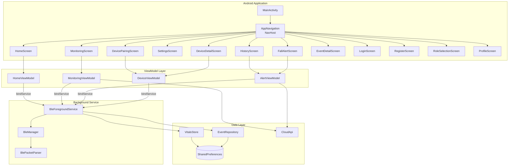
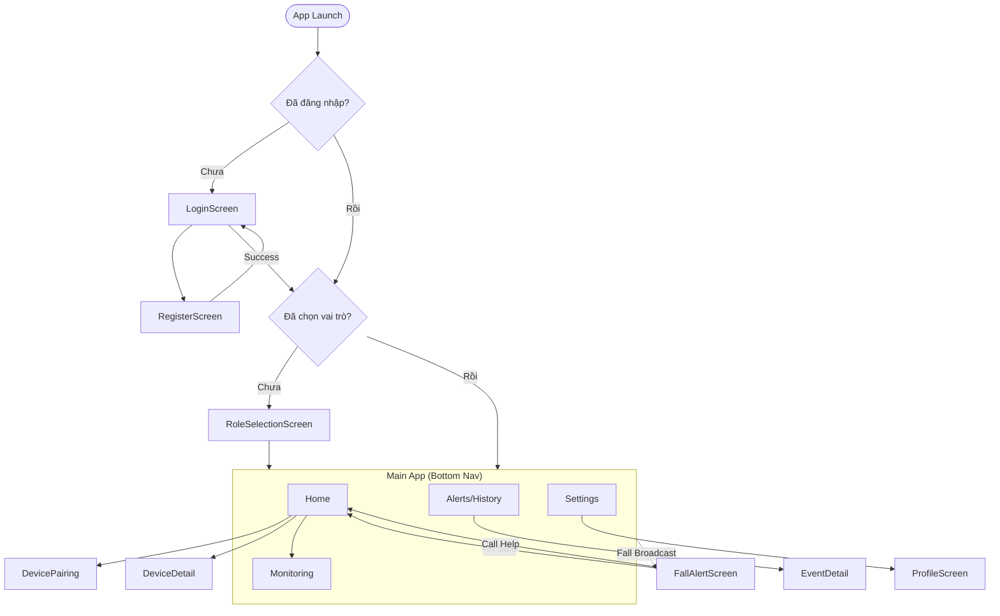
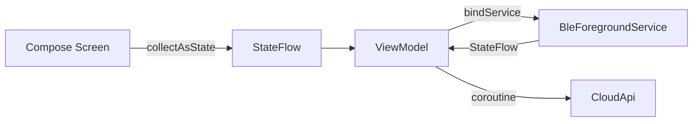
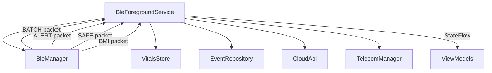
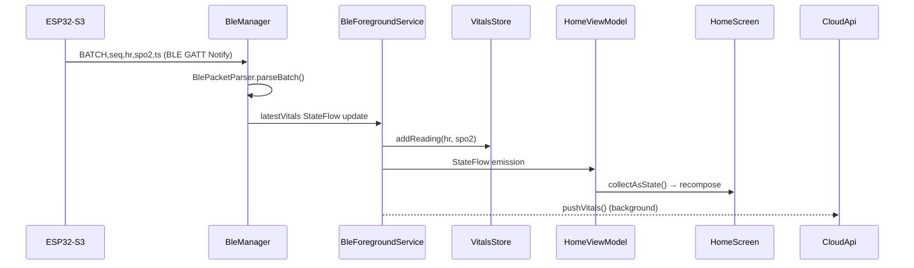
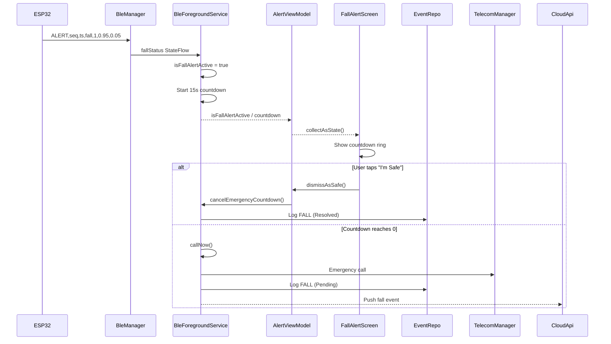
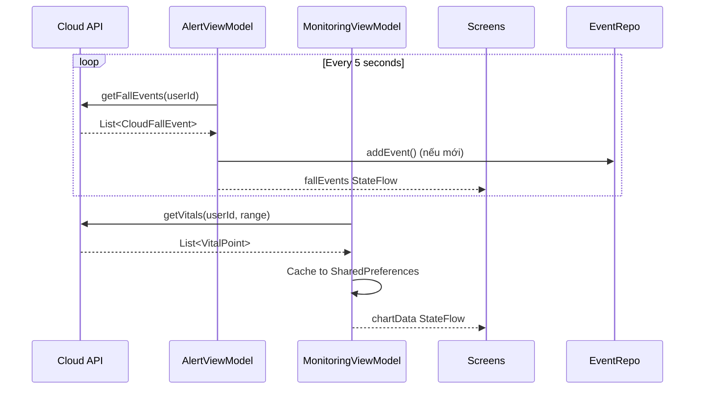
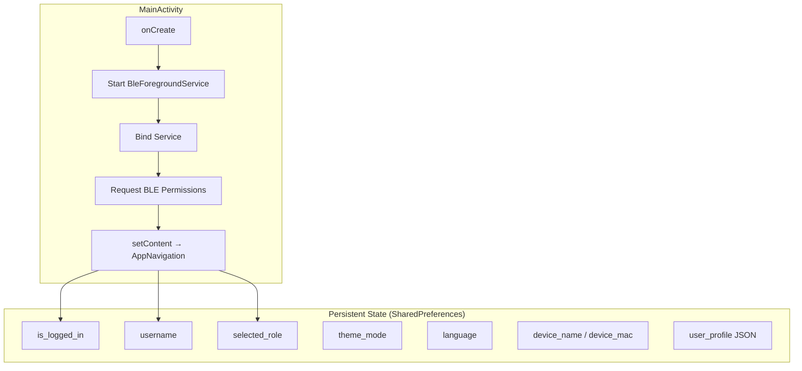

# CareLink (AIFD) — UI Architecture

> **Ứng dụng Android** trong hệ thống **CaraFall Edge-AIoT Wearable Elderly Safety Monitoring**.
> Công nghệ: **Jetpack Compose · MVVM · Kotlin Coroutines/Flow · Material 3**

---

## 1. Tổng quan kiến trúc



---

## 2. Luồng điều hướng (Navigation Graph)

### 2.1 Route definitions

| Route | Screen | Mô tả |
|---|---|---|
| `login` | `LoginScreen` | Đăng nhập (CloudApi) |
| `register` | `RegisterScreen` | Đăng ký tài khoản mới |
| `role_selection` | `RoleSelectionScreen` | Chọn vai trò Wearer / Caregiver |
| `home` | `HomeScreen` | Trang chủ — tổng quan sức khỏe & thiết bị |
| `monitoring` | `MonitoringScreen` | Biểu đồ HR/SpO2 chi tiết (Live/1h/24h) |
| `alerts` | `HistoryScreen` | Lịch sử sự kiện (ngã, mất kết nối, v.v.) |
| `settings` | `SettingsScreen` | Cài đặt giao diện, ngôn ngữ, vai trò, tài khoản |
| `fall_alert` | `FallAlertScreen` | Cảnh báo ngã toàn màn hình + đếm ngược 15s |
| `device_pairing` | `DevicePairingScreen` | Quét & ghép đôi BLE |
| `device_detail` | `DeviceDetailScreen` | Chi tiết thiết bị đang kết nối |
| `event_detail` | `EventDetailScreen` | Chi tiết một sự kiện |
| `profile` | `ProfileScreen` | Xem/sửa hồ sơ người dùng |

### 2.2 Luồng điều hướng



### 2.3 Bottom Navigation Bar

Sử dụng component `AifdFloatingBottomBar` — thanh điều hướng dạng pill nổi.

| Tab | Icon (selected) | Icon (unselected) | Route |
|---|---|---|---|
| Home | `Icons.Filled.Home` | `Icons.Outlined.Home` | `home` |
| Health | `Icons.Filled.MonitorHeart` | `Icons.Outlined.MonitorHeart` | `monitoring` |
| Alerts | `Icons.Filled.Notifications` | `Icons.Outlined.Notifications` | `alerts` |
| Settings | `Icons.Filled.Settings` | `Icons.Outlined.Settings` | `settings` |

> Bottom bar **ẩn** khi ở các màn hình: `fall_alert`, `device_pairing`, `login`, `register`, `role_selection`.

---

## 3. Chi tiết từng màn hình

### 3.1 LoginScreen
- **File:** `ui/screens/LoginScreen.kt`
- **Input:** username, password (có toggle hiển thị)
- **Logic:** Gọi `CloudApi.login()` trên `Dispatchers.IO`
- **Output:** `onLoginSuccess(userId, UserProfile)` → lưu vào `SharedPreferences`
- **Đặc biệt:** Tài khoản `000/000` bypass API (offline dev mode)

### 3.2 RegisterScreen
- **File:** `ui/screens/RegisterScreen.kt`
- **Fields:** username, password, confirm, caregiverName, wearerName, bornYear, gender, phone
- **Logic:** `CloudApi.register()` → `onRegisterSuccess(UserProfile)`

### 3.3 RoleSelectionScreen
- **File:** `ui/screens/RoleSelectionScreen.kt`
- **Mục đích:** Chọn `UserRole.WEARER` hoặc `UserRole.CAREGIVER`
- **Ảnh hưởng:** Quyết định toàn bộ UI (BLE vs Cloud, Live vs 1h/24h)

### 3.4 HomeScreen

| Vai trò | Nội dung hiển thị |
|---|---|
| **Wearer** | GreetingBanner (có nút Emergency) → DeviceCard / Disconnected Alert / UnpairedCard → HR Card → SpO2 Card → Pair Device button |
| **Caregiver** | GreetingBanner (không có Emergency) → CaregiverHealthSummaryCard (HR 1h stats) → CaregiverHealthSummaryCard (SpO2 1h stats) |

- **ViewModel:** `HomeViewModel` + `MonitoringViewModel` (caregiver fetches 1h cloud data)
- **Data flow:** `StateFlow<HomeUiState>` → `collectAsState()` → Compose recomposition

### 3.5 MonitoringScreen

```
┌─────────────────────────────────┐
│  [♥ Heart Rate] [💧 SpO2]  ← TabRow
├─────────────────────────────────┤
│  [Live] [1 Hour] [24 Hours] ← TimeRangeSelector
├─────────────────────────────────┤
│  Current Value Card (Live only) │
│  ┌─────────────────────────┐   │
│  │ 72 bpm      [Normal]    │   │
│  └─────────────────────────┘   │
├─────────────────────────────────┤
│  Chart Card (1h / 24h only)    │
│  ┌─────────────────────────┐   │
│  │ ~~LineChart~~           │   │
│  └─────────────────────────┘   │
│  [Avg: 72] [Min: 60] [Max: 95] │
├─────────────────────────────────┤
│  Info Card (normal range)       │
└─────────────────────────────────┘
```

- **Wearer:** Live (BLE real-time) + 1h/24h (local VitalsStore)
- **Caregiver:** Chỉ 1h/24h (Cloud API), tự chuyển sang 1h nếu đang ở Live
- **ViewModel:** `MonitoringViewModel` — quản lý `MetricTab`, `TimeRange`, `CloudLoadState`

### 3.6 FallAlertScreen
- **File:** `ui/screens/AlertScreen.kt`
- **Trigger:** `BleForegroundService` phát broadcast `ACTION_FALL_ALERT` → `AppNavigation` nhận → navigate to `fall_alert`
- **Countdown:** Owned by Service, observed via `AlertViewModel.uiState.countdown`
- **Actions:**
  - "I'm Safe" → `AlertViewModel.dismissAsSafe()` → cancel countdown, log event
  - "Call for Help" → `AlertViewModel.callForHelp()` → `TelecomManager` emergency call
  - Countdown = 0 → auto `callForHelp()`
- **UI:** Pulsing warning icon + circular countdown ring (Canvas) + 2 action buttons

### 3.7 HistoryScreen
- **Data:** `AlertViewModel.uiState.fallEvents` (from `EventRepository`)
- **Filters:** All / Falls / Safe / Vitals / Disconnects / Alerts (FilterChip)
- **Pagination:** Hiển thị 10 đầu, nút "Xem thêm" cho phần còn lại
- **Actions:** Clear all (with confirmation dialog), click → EventDetailScreen

### 3.8 SettingsScreen
- **Sections:**
  - **Appearance:** Theme (Light/Dark/System), Language (EN/VI), Role switch
  - **Account:** Profile, Change Password (dialog → `CloudApi.changePassword()`)
  - **Danger Zone:** Logout (with confirmation)
- **Dialogs:** `SelectionDialog` (reusable), `ChangePasswordDialog`, `AlertDialog` (logout)

### 3.9 DevicePairingScreen & DeviceDetailScreen
- **Pairing:** BLE scan → list nearby devices → tap to connect → `BleManager.connect(address)`
- **Detail:** Device name, ID, battery, signal, firmware, last sync → Reconnect / Disconnect / Rename

### 3.10 ProfileScreen
- **Display:** Username, caregiver info, wearer info (name, born year, gender, phone)
- **Edit:** Inline editing → `CloudApi.updateProfile()` → `onUpdateProfile()`

---

## 4. ViewModel Layer (MVVM)

### 4.1 Kiến trúc chung



Tất cả ViewModel kế thừa `AndroidViewModel` và bind đến `BleForegroundService` qua `ServiceConnection`.

### 4.2 HomeViewModel
```kotlin
data class HomeUiState(
    val device: DeviceInfo? = null,
    val healthData: HealthData? = null
)
```
- Observe `BleManager.bleState` → cập nhật device info
- Observe `BleManager.latestVitals` → cập nhật HR/SpO2/status
- Lưu device name/MAC vào SharedPreferences

### 4.3 MonitoringViewModel
```kotlin
data class MonitoringUiState(
    val activeTab: MetricTab,        // HEART_RATE | SPO2
    val timeRange: TimeRange,        // LIVE | ONE_HOUR | TWENTY_FOUR_HOURS
    val chartData: List<Int>,
    val healthData: HealthData?,
    val cloudLoadState: CloudLoadState,
    val hr1hStats: Triple<Int,Int,Int>,
    val spo21hStats: Triple<Int,Int,Int>
)
```
- **Live:** Lấy từ `VitalsStore.getLiveHR()/getLiveSpO2()`
- **1h/24h:** Lấy từ `VitalsStore.get1hChart()/get24hChart()` hoặc `CloudApi.getVitals()`
- Cloud data cached trong SharedPreferences (CSV format)

### 4.4 AlertViewModel
```kotlin
data class AlertUiState(
    val isFallAlertActive: Boolean,
    val countdown: Int,              // 15 → 0
    val fallEvents: List<FallEvent>,
    val selectedEventId: String?
)
```
- Observe `service.isFallAlertActive` và `service.countdownSeconds`
- Caregiver: Polling `CloudApi.getFallEvents()` mỗi 5 giây

### 4.5 DeviceViewModel
```kotlin
data class DeviceUiState(
    val device: DeviceInfo?,
    val nearbyDevices: List<NearbyDevice>,
    val isScanning: Boolean,
    val connectingDeviceId: String?
)
```
- Proxy giữa UI và `BleManager` (scan, connect, disconnect)
- Auto-connect bonded ESP32 khi service khởi động

---

## 5. Service & BLE Layer

### 5.1 BleForegroundService



- **Foreground Notification:** Duy trì kết nối BLE khi app ở background
- **Fall Detection Flow:** `ALERT packet` → `isFallAlertActive = true` → countdown 15s → auto call
- **Vitals Processing:** `BATCH packet` → parse HR/SpO2 → `VitalsStore.addReading()` → `CloudApi.pushVitals()`
- **Auto-reconnect:** Loop trong `serviceScope` retry kết nối mỗi 10s

### 5.2 BleManager
- GATT client kết nối ESP32-S3 qua BLE
- Parse 4 loại packet: `ALERT`, `SAFE`, `BATCH`, `BMI` (via `BlePacketParser`)
- Descriptor write queue (tránh lỗi BLE khi ghi nhiều descriptor đồng thời)
- Auto-connect bonded device bằng tên/MAC address

### 5.3 BlePacketParser
| Packet | Format | Mục đích |
|---|---|---|
| `ALERT` | `ALERT,seq,ts,fall,status,fallProb,nonFallProb` | Phát hiện ngã |
| `SAFE` | `SAFE,seq,ts` | Xác nhận an toàn |
| `BATCH` | `BATCH,seq,hr0\|..\|hr4,spo2_0\|..\|spo2_4,ts0\|..\|ts4` | Batch vitals (5 readings) |
| `BMI` | `BMI,seq,ts,peakAccG,peakGyroDps,active` | Body motion index |

---

## 6. Data Layer

### 6.1 VitalsStore
Lưu trữ và tổng hợp dữ liệu HR/SpO2 theo 3 cấp:

| Buffer | Window | Cấu trúc | Persistence |
|---|---|---|---|
| `liveBuffer` | 25 giây | `ArrayDeque<RawPoint>` | In-memory only |
| `fiveMinBuckets` | 12 × 5min = 1h | `LinkedHashMap<Long, Bucket>` | SharedPreferences (CSV) |
| `hourlyBuckets` | 24 × 1h = 24h | `LinkedHashMap<Long, Bucket>` | SharedPreferences (CSV) |

- Throttled save: ghi SharedPreferences tối đa 1 lần / 30 giây

### 6.2 EventRepository
- Singleton, lưu `List<FallEvent>` trong SharedPreferences (JSON via Gson)
- Expose `StateFlow<List<FallEvent>>` cho AlertViewModel
- Event types: `FALL`, `SAFE`, `VITALS`, `DISCONNECT`, `SYNC_FAILED`, `LOW_BATTERY`, `ALERT`

### 6.3 CloudApi
- OkHttp + Gson, base URL: `https://edge-aiot-wearable-elderly-safety-4c1i.onrender.com/`
- Endpoints: `login`, `register`, `pushVitals`, `getVitals`, `getFallEvents`, `changePassword`, `updateProfile`

---

## 7. Theming & Localization

### 7.1 Theme System
```
AIFDTheme (Composable)
├── MaterialTheme (Light / Dark color scheme)
├── ExtendedColors (safe, warning + containers)
├── AppTypography
└── CompositionLocalProvider
```

| Mode | Primary | Error | Safe | Warning |
|---|---|---|---|---|
| Light | Blue40 | Red40 | Green50 | Amber40 |
| Dark | Blue80 | Red80 | Green80 | Amber80 |

- `AppThemeMode`: `LIGHT`, `DARK`, `SYSTEM`
- `AIFDThemeExt.colors` → access extended colors (safe/warning)

### 7.2 Localization
- `AppLanguage`: `ENGLISH`, `VIETNAMESE`
- `AppStrings` class: ~150+ chuỗi song ngữ, runtime switching
- Cung cấp qua `CompositionLocal` (`LocalAppStrings`, `LocalAppLanguage`)
- Random greeting mỗi ngày (hash-based, 16 mẫu mỗi ngôn ngữ)

---

## 8. Reusable UI Components

### 8.1 Core Components (`ui/components/`)

| Component | File | Mô tả |
|---|---|---|
| `LineChart` | `Charts.kt` | Biểu đồ đường HR/SpO2 (Canvas) |
| `StepsBarChart` | `Charts.kt` | Biểu đồ cột bước chân |
| `DeviceCard` | `DeviceCard.kt` | Card thông tin thiết bị |
| `StatCard` | `StatCard.kt` | Card thống kê nhỏ |
| `StatusBadge` | `StatusBadge.kt` | Badge trạng thái (Normal/High/Low) |
| `SectionHeader` | `SectionHeader.kt` | Header cho section |

### 8.2 AIFD Design System (`ui/components/aifd/`)

| Component | Mô tả |
|---|---|
| `AifdFloatingBottomBar` | Thanh nav dạng pill nổi, có animation |
| `AifdEmergencyNavButton` | Nút SOS tròn đỏ |
| `AifdHealthMetricCard` | Card metric sức khỏe (icon + value + status badge) |
| `AifdChartCard` | Card chứa biểu đồ (có loading spinner, refresh) |
| `AifdChartEmptyState` | Trạng thái trống cho biểu đồ |
| `AifdSectionCard` | Card section trong Settings |
| `AifdSettingsRow` | Row item trong Settings |
| `AifdEmptyState` | Trạng thái trống chung |

---

## 9. Luồng dữ liệu chính

### 9.1 Wearer — Real-time Vitals



### 9.2 Fall Detection → Emergency Call



### 9.3 Caregiver — Cloud Polling



---

## 10. Vai trò ảnh hưởng lên UI

| Tính năng | Wearer | Caregiver |
|---|---|---|
| BLE Connection | ✅ Scan/Connect/Auto-reconnect | ❌ Không cần BLE |
| Live Vitals | ✅ Real-time từ BLE | ❌ Ẩn tab Live |
| 1h/24h Charts | ✅ Local VitalsStore | ✅ Cloud API |
| Emergency Button | ✅ Trên GreetingBanner | ❌ Ẩn |
| Fall Alert Screen | ✅ Hiển thị + countdown | ❌ Chỉ nhận event từ cloud |
| Device Cards | ✅ Hiển thị đầy đủ | ❌ Ẩn |
| Cloud Polling | ❌ | ✅ Mỗi 5 giây |
| Info Cards (HR/SpO2 range) | ✅ Hiển thị | ❌ Ẩn |

---

## 11. Lifecycle & State Management



- **Session:** Login state, role, theme, language → `SharedPreferences`
- **Health data:** VitalsStore buckets → `SharedPreferences` (CSV, ≤2KB)
- **Events:** EventRepository → `SharedPreferences` (JSON via Gson)
- **BLE state:** In-memory `StateFlow` trong `BleManager`

---

## 12. Tóm tắt file structure

```
com.aifd/
├── MainActivity.kt              # Entry point, service binding, permissions
├── navigation/
│   └── AppNavigation.kt         # NavHost, routes, bottom bar, broadcast receiver
├── ui/
│   ├── screens/
│   │   ├── LoginScreen.kt       # Auth: login
│   │   ├── RegisterScreen.kt    # Auth: register
│   │   ├── RoleSelectionScreen.kt # Role picker
│   │   ├── HomeScreen.kt        # Dashboard (role-aware)
│   │   ├── MonitoringScreen.kt  # HR/SpO2 charts (Live/1h/24h)
│   │   ├── AlertScreen.kt       # Fall alert + countdown
│   │   ├── HistoryScreen.kt     # Event history + filters
│   │   ├── SettingsScreen.kt    # App settings + dialogs
│   │   ├── DevicePairingScreen.kt # BLE scan & pair
│   │   ├── DeviceDetailScreen.kt  # Connected device info
│   │   ├── EventDetailScreen.kt   # Single event detail
│   │   └── ProfileScreen.kt      # User profile edit
│   ├── components/
│   │   ├── Charts.kt            # LineChart, StepsBarChart
│   │   ├── DeviceCard.kt        # Device info card
│   │   ├── StatCard.kt          # Statistics card
│   │   ├── StatusBadge.kt       # Health status badge
│   │   ├── SectionHeader.kt     # Section header
│   │   └── aifd/                # Design system components
│   │       ├── BottomNav.kt     # Floating bottom bar + SOS button
│   │       ├── HealthMetric.kt  # Health metric card
│   │       ├── ChartCard.kt     # Chart container
│   │       ├── SectionCard.kt   # Settings section
│   │       ├── SettingsRow.kt   # Settings item row
│   │       └── EmptyState.kt    # Empty state views
│   ├── theme/
│   │   ├── Theme.kt             # AIFDTheme, Light/Dark schemes, ExtendedColors
│   │   ├── Color.kt             # Color palette constants
│   │   └── Type.kt              # Typography
│   └── localization/
│       └── AppStrings.kt        # Bilingual strings (EN/VI), CompositionLocal
├── viewmodel/
│   ├── HomeViewModel.kt         # Dashboard state
│   ├── MonitoringViewModel.kt   # Charts, time ranges, cloud sync
│   ├── AlertViewModel.kt        # Fall alerts, event history, cloud polling
│   └── DeviceViewModel.kt       # BLE device management
├── service/
│   └── BleForegroundService.kt  # Background BLE, fall logic, emergency call
├── ble/
│   ├── BleManager.kt            # GATT client, scan, connect, notifications
│   └── BlePacketParser.kt       # CSV packet parsing (ALERT/SAFE/BATCH/BMI)
└── data/
    ├── Models.kt                # Data classes (DeviceInfo, HealthData, FallEvent...)
    ├── VitalsStore.kt           # Time-bucketed vitals storage
    ├── EventRepository.kt       # Event persistence (SharedPreferences + Gson)
    ├── CloudApi.kt              # REST API client (OkHttp)
    └── MockDataProvider.kt      # Demo data for development
```

---

*Tài liệu được tạo tự động bằng phân tích mã nguồn — CareLink v1.0.0*
