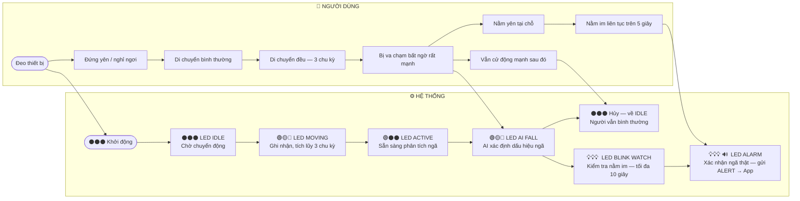
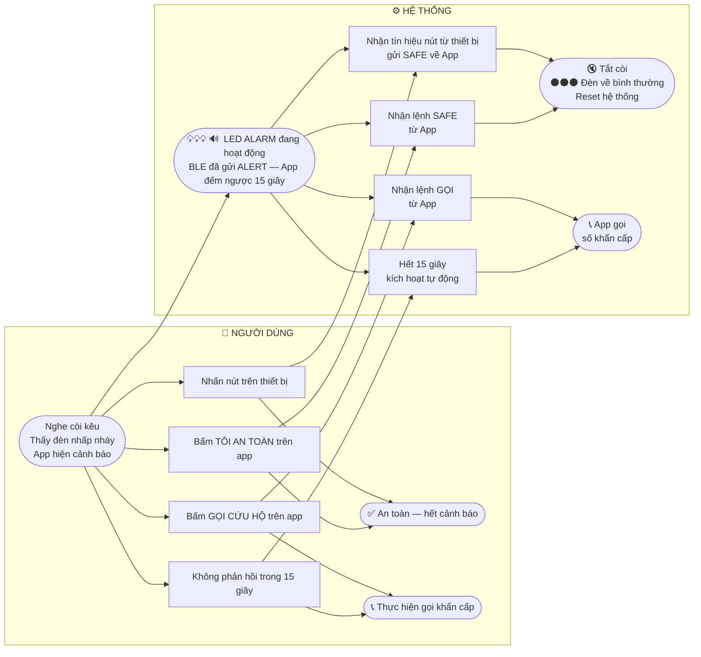
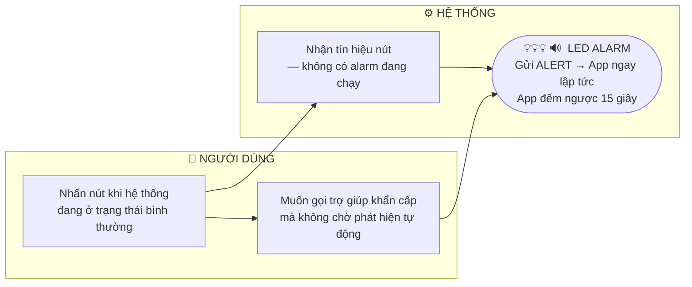

# Sơ đồ hành động hệ thống AIFD
> Song song: **hành vi người dùng** (trái) ↔ **trạng thái hệ thống** (phải)  
> Mũi tên ngang = quan hệ nhân quả giữa hai bên

---

## Sơ đồ 1 — Theo dõi & phát hiện ngã

---

## Sơ đồ 2 — Phản hồi khi có báo động

---

## Sơ đồ 3 — Kích hoạt SOS thủ công

---

## Bảng tương ứng nhanh

| Hành vi người dùng | Đèn trên thiết bị | Trạng thái hệ thống |
|---|:---:|---|
| Đứng yên / nghỉ ngơi | ⚫⚫⚫ | IDLE — chờ chuyển động |
| Di chuyển nhẹ (1–2 chu kỳ) | 🟢🟡🔴 | MOVING — đang tích lũy |
| Di chuyển đều 3 chu kỳ trở lên | 🟢⚫⚫ | ACTIVE — sẵn sàng phân tích |
| Va chạm mạnh bất ngờ | 🟢🟡⚫ → 🟢🟡🔴 | AI đang chạy → xác định dấu hiệu ngã |
| Vẫn cử động mạnh sau va chạm | ⚫⚫⚫ | Hủy — người bình thường |
| Nằm yên — đang kiểm tra | 💡💡💡 | BLINK WATCH — đo thời gian nằm im |
| Nằm im đủ 5 giây | 💡💡💡 🔊 | **ALARM — gửi cảnh báo về App** |
| Nhấn nút khi có còi | ⚫⚫⚫ | Gửi SAFE → App — reset hệ thống |
| Nhấn nút khi bình thường | 💡💡💡 🔊 | **SOS thủ công — gửi ALERT → App** |
